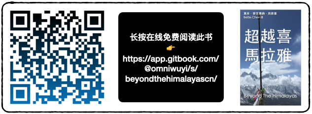
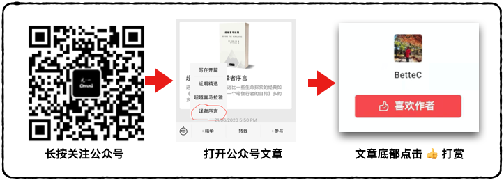
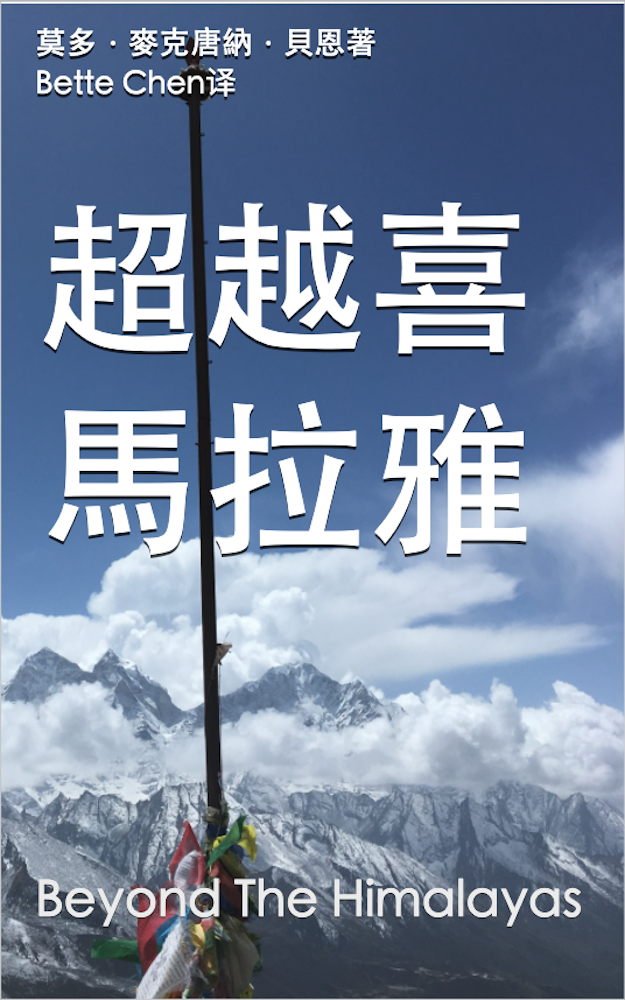

# 首页

## 出版信息

《超越喜马拉雅》现已在全球 Amazon/亚马逊 书店出版了，请[在此认购](https://www.amazon.com/dp/B08TVMYHYB/ref=sr_1_1?dchild=1&keywords=Bette+Chen&qid=1611545450&s=digital-text&sr=1-1)。

我们非常幸运能够使用此书的全球公共许可，将其中文版本开源免费分享给大家。Amazon/亚马逊书店无法发行免费书籍，因此我们将其定为最低价 US$0.99，让更多朋友能够在 Kindle 和其他电子书软件上轻松阅读此书。Amazon 目前只允许繁体中文出版，未来将会支持简体中文丛书

我们也将此书免费发布于 Gitbook，👇伙伴们可以通过此网站免费在线阅读。

此书的翻译、校对、出版都是由 Omni One 公益完成的，如果你觉得此书对你有所启发、有所触动，请慷慨打赏，让我们能够继续翻译此类书籍。

请关注 Omni One 微信公众号 **omniwuyi，通过“译者序言”一文进行打赏 🙏**

ISBN 978-0-473-55825-3

版权许可

Shield: 

This work is licensed under a [Creative Commons Attribution 4.0 International License](http://creativecommons.org/licenses/by/4.0/).

