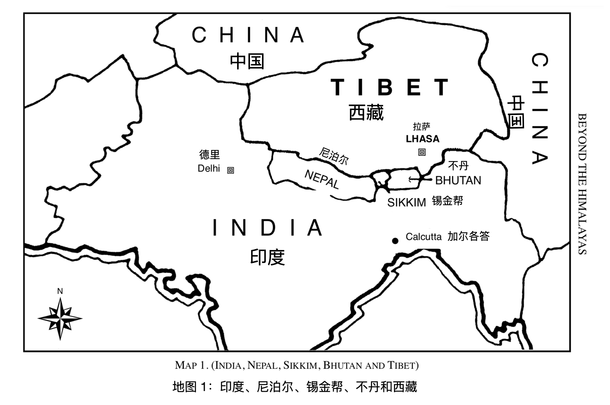

# 简介

在我另一本书《使用更高的力量》的简介里，我写了下面几句话：

“我很荣幸能成为向世人传递这一信息的人；但是我没有任何特权，我跟其他同胞们也没有任何不同的灵性品质。“

“多年以来，我一直是内在教导勤恳的工作者和学生，治愈生病的人、在世界各地传授我所了悟的真理，并获得了非常大的成功。但我现在知道，这并不是我个人的功劳，我一路都在灵魂层面被帮助着和受着指引。“

“直到某个晚上，一位神秘的访客出现在我面前，我才知道我真正的使命是什么。他说：‘我和你在一起很久了，只是你并不知道。现在是时候让你知道我了。我将指引你前往西藏的喜马拉雅山脉，在这里你将获得你真正但使命的指引。许多人被呼唤，但极少数被选择。你准备好放下一切跟随我吗？无需恐惧，因为世界会因你欣喜 - 你将传递的信息会消除人们混乱的思绪；那些能听到你声音的人就是我的人。我将陪在你身边，你的力量不会消逝，因为你被生命选中，也将被生命所支持。” 然后他就像他来的时候一样默默地离开了。“

“至此，我被逐步引领到西藏的喜马拉雅山；在雄壮雄伟的积雪山脉的隐蔽之处，那里的空气如此清澈，频率如此纯净，以至天堂之门向大地开启，天地合一，我被告知要做什么和去往哪里。在此期间，我目睹了无比如此奇妙而难以用语言形容的灵性的显化。此后我会用写书的形式向世人详细的描述这一切的发生 - 我的所闻所识，我的旅行和经历，以及通往大西藏喜马拉雅山脉人迹罕至的途径。我还将透露与上师们每天会面的喜悦，上师们的大爱、同情心和朴素至简是他们强大力量背后的秘诀。因为爱就是生命，生命就是爱。 “因为他如此爱世界，所以他派来了他唯一的儿子，那些听见他的人会找到永恒不朽。” 当灵魂准备好的时候，上师就会出现，那些准备好的人会听到并知道上师的声音宣告着，所有的国度都是一个国度，所有的人都是一个人，所有的生命都是一个生命，都是一棵树上的多个分支，但都是同一个生命：万事万物都在一个生命里，生命也在万事万物中，一命一体。“

“我不敢自夸；我只旷野中的一个声音，呼唤着生命的子女们聆听真理。为此，我被告知我出生了。” 从那以后，我已经写了另外九本书，其名称出现在首页上。现在该写我在介绍《您可以使用的更高功率》中承诺的书了。 首先，我将向您介绍一些关于我自己的东西，以及对这种伟大冒险的渴望是如何第一次进入我的生活的。 这绝不是自传，因为我不想写我自己的书，我会把它留给别人。 很多人问我为什么去西藏。好吧，在这背后有一个有趣的故事，我将使其尽可能简洁明了。 在大多数人的生活中，很少有一种生命力可以实现，因此将他们推向了他们不知道的目标。我的生活就是这种情况。 现在这本书既不是文字的文学作品，也不是童话故事。揭示真相的书也不是一本，没有一本书能做到。我会在思想和事件浮现在脑海时写下。

