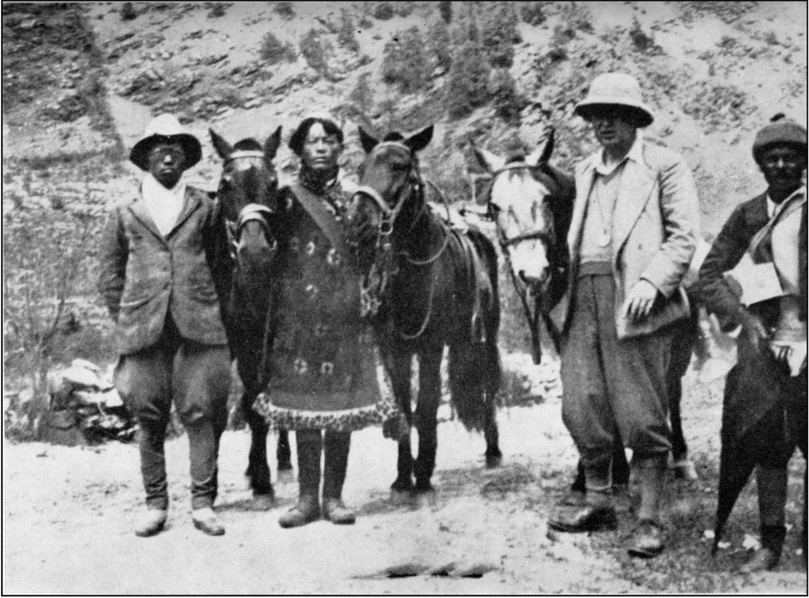
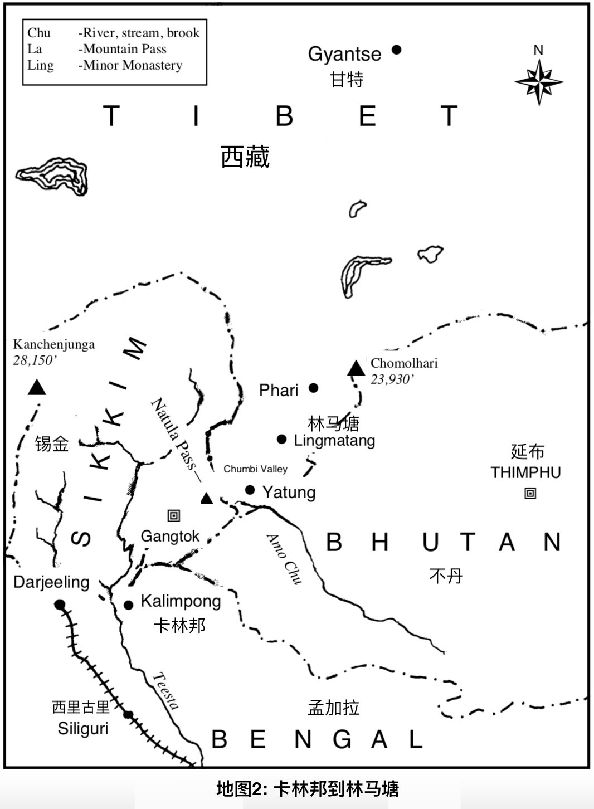
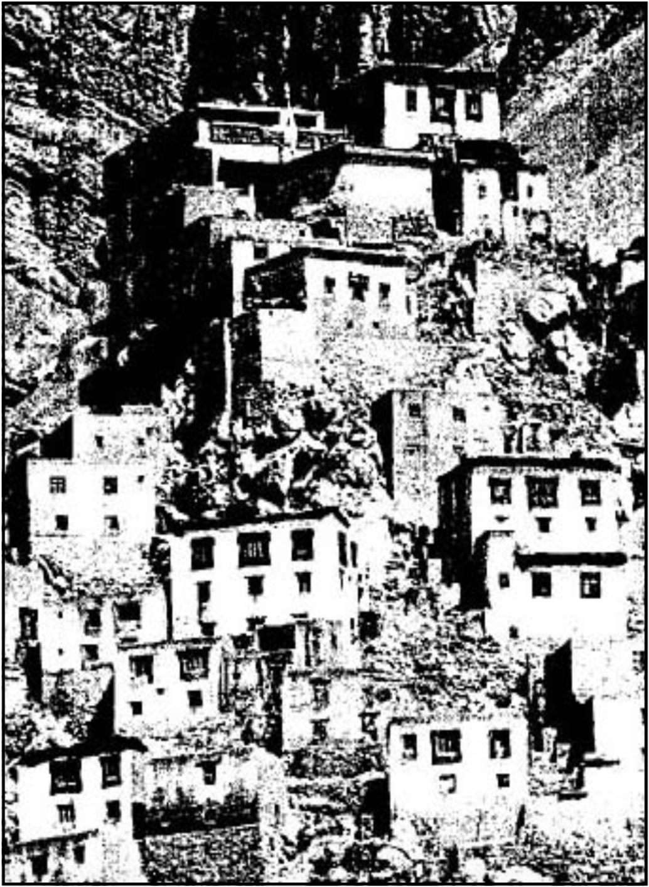

# 第一章

我在苏格兰高地出生和长大。小时候，我记得最早7岁的时候就有过许多灵异体验。我非常清楚有形的世界和无形的世界只隔了一层面纱，因为我天生就拥有这样的天赋，如果可以称之为天赋，我相信所有人都拥有它，只是自己不知道而已。

其中有些经历跟我的父母有关，也跟我所知道的有关，但他们也不鼓励我，对很多人来说我懂的太多太准确了。当我还很小上学的时候，我就拥有了一些书，但是我不知道他们是哪来的。这些是古代瑜伽书籍，你可能觉得很奇怪，但是我似乎就是知道和清楚是怎么回事，让我的长辈很是惊讶。但有些东西这些书还是不能解答。那个时候我无法解释那是什么。但是现在回忆起来，我肯定是知道的。这些书只给我一个概念，但概念不是事物本身，至此我完全了悟了。

“生命”这个词或生命这个概念并不是生命本身； “上帝”这个词也不是上帝本身。每个传道者和老师都在试图告诉你生命是什么，但是他们只能给你一个关于生命的概念，但这不是生命。就因为我们有很多不同的概念不同的定义，所以我们活在一个宗教，群体和民族分离和纷争的世界里。

我大约七岁的时候看到耶稣的脸。那是一张充满生命力生动的面孔，不是那种从书里或复制品里看到的画像。他是活的、就像你跟我一样生机勃勃地活着。这对我的影响太大了，当时我被安置在床上，以朗姆酒和打了鸡蛋在里面的牛奶为食。医生说我的心脏移位了两英寸。在床上我百般聊赖。某早晨我听到一个声音说：“快起床！出去，跑起来、跳起来！” 我真这样做了，从那一刻开始我就痊愈了。这让我坚信根本没有死亡，没在肉体里的其实一直都活着，我下决心关于这个一定要了解更多。医生相当的震惊，因为我从那一刻开始，变得百分百健康。

从那以后我发现自己可以从很高的地方跳下来，在半空中保住自己，然后轻轻用脚趾着地。尽管我还无法理解这一切的意义所在，但我已经在我那些珍藏的瑜伽书中读到了相关内容。我读到了瑜伽行者如何让自己在空中飘浮，我肯定是在无意识不知道其方法的状况下做了类似的事情。我做了许多无所畏惧的事情让我的父母感到非常焦虑。尽管他们知道我有点与众不同，但他们对我的焦虑仍然存在，我也也非常清楚这个事实。

我特别喜欢冬天的夜晚。我会坐在祖先家巨大的壁炉旁，右脚总是放在壁炉前的栏杆上，外套挂在椅背。童年时代直到15岁，我都一直穿苏格兰的民族服装，舒适的苏格兰短裙，只要有机会就经常穿着短裙参加高地运动。壁炉上悬挂着那把大刀，是我的祖先在许多战斗中（包括卡洛登战役\*）都曾使用过的。壁炉两侧是麦克唐纳家族部落在低地和英国边境突袭中使用的剑和手枪。

我会很入神地听父亲讲述麦克唐纳家族的诸多冒险故事，他也会讲一些他自己的冒险经历，因为他曾去过许多国外的地方，我们会一遍一遍地听这些故事。我从来都听不厌这些故事，他们在我心中滋生了对旅行和知识的渴求，也致使我后来去到了世界各个地方。而且随着年龄的增长，这种热情越来越强烈。我开始展翅飞向遥远的土地。

所有苏格兰人都坚持要他们的孩子接受良好的教育，所以我也被送进了大学，尽管我学习医学，但它对我来说却没有吸引力，因为当我知道生命是唯一的生命力量的时候，医学就像对待死物的学科。然而，这样的背景对我日后在全世界各地疗愈的工作有很大的帮助。我会在另一本书中解释一些奇迹般的结果。

我决心要去印度，在那里我找到了瑜伽行者并获得了很多的智慧和知识，但这还不能满足我，即使它指引我通向我最终想要达到的目的。尽管我多次访问印度，我也依旧不能满足。我沿着波斯湾航行到巴士拉。从那里我沿着底格里斯河徒步旅行，越过沙漠到达幼发拉底河。我跟阿拉伯人住在一起，逛到巴格达古城，那里有风景如画的清真寺和宣礼塔，探访了巴比伦的古代遗址，并在古老的波斯和巴勒斯坦里寻找古圣经故事的遗迹。

第一次世界大战在1914年爆发时，我加入了高地军团，被任命为军官，并被授予军事十字勋章，这是表彰我在炮火下挽救生命并因此四次受伤。战争结束后，我再次穿过中国和日本去到了印度。我去了法国印度支那，在那探寻了古老的柬埔寨文明废墟，这个文明似乎在一夜之间消失了，留下了的宏伟废墟为其存在的唯一证据。

然后我从东到西、从西到东穿越加拿大，行驶了六千多英里到达美国，还去了墨西哥和南美。我徒步穿越非洲，探寻了罗得西亚的津巴布韦古遗址，据说是四千年前就存在的文明，这正好是莱特·哈格德写了他的那本《她和所罗门王的宝藏》。在巴西也发现了类似的废墟，我觉得这些废墟的相似之处都指向了同一个点。终有一天，我们的考古学家可能会揭秘这个古老文明的起源。

我追溯了利文斯顿博士【2】和斯坦利【3】爵士的脚步，探寻了雄伟的维多利亚瀑布上方的赞比西河。我研究了古埃及的遗迹，到过欧洲大部分地方，还穿越了澳大利亚、新西兰和南太平洋群岛。我去了地球的四个角落，航行了七个大洋。我在世界各地疗愈和教学，闻名于四大洲，但我人生中最伟大的冒险尚未实现 - 神秘的西藏禁地 - 世界屋脊之旅。

我有过一个独特的经历。当我几乎已经放弃了实现目标时，一个人出现在我面前告诉我要去非洲，然后从那里再次去到印度。这个人给我提供了所有路线的细节，并告诉我会遇到一个人，他会亲自带我穿越喜马拉雅山。

（这让我回忆起一个有趣又非同寻常的往事，我必须说明一下因为它与接下来发生的事情有关。那时我刚刚离开西藏，正在加拿大蒙特利尔作我的第一场演讲。我讲了大约半个小时，每个人都已就坐，门也关上了。奇斯霍尔姆夫人【4】和接待人员在外面的门厅里，突然一个身影不知道从哪里出现了，说：“告诉他，我很高兴他完成了我对他的要求。” 刚说完他就消失了。好几个人都看到的了这一幕。我知道答案，但他们不知道。有些人至今还在谈论这个经历；就在前几天，我还收到了一位来自蒙特利尔的女士来信，信中她还提到这事件发生的时候她也在场）

您可以想象我当时激动的心情，就像那艘叫 Inchanga 的轮船沿着胡格利河驶入加尔各答（我在南非德班登上过这艘船）。最棒的时刻快要到来了，尽管这是我第五次去印度了，但那里总是有新鲜的事物。遇见未曾谋面的人也让我很激动和期待。当船驶入码头时，数百名工人的声音淹没了我与周围人的谈话声。

我迅速地上了岸，很快我就被几十个人围了起来，都是来要钱的。但我去过印度好几次，也懂得他们的习俗，还能用他们听得懂的语言对话。我四处寻找可能来接我的人，也没找到，难道这是骗局？大部分旅客都离开了，我带上行李，前往位于加尔各答公园对面的格兰大酒店。

我在那住了几天，拜访了老朋友尤迦南達【5】和拉瑪那【6】，和其他一些我认识的瑜伽行者。我与他们讨论了我的问题，他们建议我不要放弃，继续喜马拉雅的旅程，我一定会见到那个跟我说话的人的。 因此，下午我就乘出租车去了火车站，安排了前往孟加拉北部西里古里的火车站，这是铁路通往喜马拉雅山最远的地点了。

出租车司机是锡克教徒，有着天使般的面孔，看我是新来的游客，带着我乱绕走了反方向的路。我知道他把戏，决定给他上一课。我们到达车站的时候，他说：“先生，五卢布！” 我递给他两卢布，这已经比正常票价多了。我用他的母语告诉他，他很幸运我没有举报他，因为这是很严重的罪行。您应该看看他的脸，天使般的表情消失了，没有怨言，对自己感到厌恶地开着车离开了。

傍晚，我拜访了我的一个上校朋友，我们曾经一起服役印度部队。他是深度研习生命，我们一直保持着深厚的友谊，直到他离开尘世进入更高的生命。他此生应该满足了自己对更多智慧和知识的渴求。

他换上了便装，然后我们去了一个印度波迪学院，那里聚集了印度教教授，医生，瑜伽行者等。我的朋友 - 加尔各答大学的沙斯特里 【7】教授，正在就古代梵文发表演讲，他是这个领域公认的权威。古代梵文似乎是一种远古印度文化的书写，似乎远比我们西方至今任何一种文化都要先进。没过多久，我就被认出了，在他的演讲之后，我就被邀请上台分享我的旅游行记，以及我现在在做的事情。我告诉了他们，而他们也特别感兴趣。

一些伟大的印度大师们也在那里，包括斯里·奥罗宾多【8】（我在《灵魂与心理疗愈》一书中写过他），尤迦南達大师，伟大的印度科学家拉瑪那，印度的民族诗人泰戈尔【9】，和伟大的甘地本人【10】，还有许多印度的引领者智者。 我的上校朋友转身对我说：“我讨厌印度这里有些人的优越性观念，让他们无法理解更高的生命，而当他们离开时，他们则更加膨胀，这只更加显示了他们幼稚的心态和堕落状态。在世界上，谦卑才是伟大的，只有当我们开始获得智慧的时候，我们才变得谦卑；当我们继续获得智慧的时候，我们会依旧谦卑。这种品质必须传承给下一代，否则我们肯定会消亡。” 我同意他的看法，所有有正确思想的人也同意。

两天后，我坐火车从加尔各答出发前往西里古里。你必须把车厢门内锁，否则即使你的车厢是预定的，而且门上都是告示，你的车厢依旧会被各种各样的人挤占。但是，这对暴民没有什么影响，一旦他们闯进来，赶都赶不走。

当我到达西里古里 - 也就是通往孟加拉北部铁路的尽头时，我看到了那个小山地火车，它将带我继续前往喜马拉雅山。当我从一列火车换成另一列火车时，我感觉到一股难闻的气味，环顾四周，我看到一个麻风病人伸出被肮脏的麻袋盖着的双手。那时，麻风病人的能靠近你三英尺以内的距离。

我可怜这个麻风病人并递给他一个卢比，这时候一名印度警察走过来要用拐杖打他。我对他说：“你打的是你自己，你知道吗？” 警察被我震惊了，然后我就走开了，让他自己思考一下我说的话。

今天，麻风病人大多获得了自由。以前，他们被困在麻风病人专属地。这让许多人躲藏起来，更助长了疾病的传播。现在他们通过注射甘草精油和其他新药的组合，有效的治疗和终结了这种疾病。

小小的山地火车车厢才到我的的肩膀高。绿漆小发动机，红漆车厢。我不得不弯腰进入，坐着的时候，我的头都碰到了车顶。很难相信如此小巧的发动机能有足够的动力，拽动十几节车厢爬上陡峭的山坡。我的思绪变成了蒸汽动力。我突然意识到是生命让一切都变得可能，我们的肉体没有自己的力量，就像发动机本身没有力量一样。

至此，我的旅程进入了另一个阶段。我们在高架桥下爬行，循环地转圈，越过了大约半小时前我们爬过的那条高架桥，在山腰上越爬越高。曲折蜿蜒，不断前行，直到达到约五千英尺，我们停在了一个叫吉利科拉的地方，然后我下了车。火车会一直开到尼泊尔的主要城镇大吉岭，位于大喜马拉雅山脚下。

在月台上，有一些在那等着的身高不超过四英尺健壮的高原妇女，每个人头顶都系着一条带子，挂在她的肩膀上，垂在她的背上。他们立刻站了起来，将吊带放在沉重的箱子下面，将它们背起，就好像它们是火柴盒一样。我惊讶地看着他们的大力气，不过我发现了其中的诀窍。吊带横过额头和肩膀，重力其实都放在背部。有人告诉我，有一位妇女背着一架钢琴，从卡林邦走到大吉岭，大约三十英里地。

我在吉利科拉坐上了我预定的汽车，然后我们依旧爬行曲折上山，直到到达卡林邦。喜马拉雅山上的这个小镇是印度、锡金和西藏之间贸易路线的起点。从这里开始，一切都通过公路和小道运输，有些道路会非常狭窄，不超过几英尺。

在卡林邦，我发现形形色色的人 - 印度人，西藏人，锡金人，尼泊尔人，不丹人，还有很多白人，他们远离高温和潮湿加尔各答，在山里度假。尼泊尔，锡金和不丹这三个山邦将印度与西藏分开。所以卡林邦是个比大吉岭更重要的城镇，因为贸易路线从这里开始。

就在这里，我召集了我的团队，包括一名口译员，一名私人陪同人员和一名保镖 - 他是个内行知道所有的路线和山贼。我雇了一只藏族小马给自己，一只给我的翻译，一只给我的保镖，一只给我的印度搬运工，两个马骡运行李，还有三个搬运工。

所有进出西藏的货物都是驴子、马骡和搬运工背来背去的。它们从卡林邦经公路和铁路运输到达加尔各答，然后再到其他目的地。大吉岭的茶是通过高山铁路运输到西里古里，然后通过铁路运输到加尔各答，进而运输到世界各地。在卡林邦，我遇到了一个同名的麦克唐纳先生，他住在喜马拉雅饭店。他是一半的西藏人，他爸爸是苏格兰人，曾在西藏亚东担任英国贸易代理，后来娶了一名藏族妇女。

麦克唐纳先生和我成为了朋友。他能说一口流利的藏语、印度语和英语，跟他在一起的时候，我开始尽可能的学习藏语。我已经会说印度语了，所以这对我很有帮助。我不得不在卡林邦等待我的入藏通信证，此时，我开始思考那个我遇到的陌生人，我想我可能必须走到西藏才能找到他。他既未出现在加尔各答、也没在卡林邦来找我，我觉得回头是愚蠢的，我必须继续前行。而且我内在的声音说：“你必须继续前行。”

我已经在这呆了三天，当我从住所所在的房子向城镇走去时，我看到一个男人穿着一件紫色的礼服，穿着比喇嘛斗篷略带紫色的衣服。他深深的吸引着我，我不能移开对他的视线。他径直走向我，用标准的英语说：“我的孩子，你已经到了。” 我无比的吃惊，以至于我无法立刻回答，我从来没想过会现在就在卡林邦跟他见面。

他把右手放在我的左肩上，我觉得自己像被充电了一样。然后他说：“我和你在一起已经很久了，只是你不知道而已。” 我其实知道这些话，他们在我脑海中回响了很长时间。然后，他透露了对我的了解，我所做的事情、我本来应该做的事情，和也许我不应该做的事情，不过他说这些都不重要。

我知道他肯定和我在一起很久了，因为他对我的生活了如指掌，我也不需要告诉他我去过的地方了。我现在最想要做的就是试图让他知道我所知道的。因此，我开始表述哲学和形而上学的东西。我说了一段时间（我无法告诉你那是多长时间，因为时间好像消失了），他安静地听着我说。我以为我会给他留下深刻的印象，至少让他觉得值得对我感兴趣。

然后他这么说：“我的孩子，正确与否并不重要，不是吗？” 彼时你就是用大锤子锤我，我也不会那么震惊。然后我听见他说：“我的孩子，明天我们会再见，你的旅途已经安排妥当，一切都会被照顾好的。”

然后他转身走了，让我完全不知所措 - 我当时就是一片空白！他说的那几句话让我深深地思考，这些话完全改变了我。我可以看到，我所拥有的一切都是在我大脑里创造出来的。我错过了我生命里最伟大的礼物 - 生命的当下。我所拥有的仅仅是语言、观念、图像。我真是个傻瓜！我太感恩这几句话了！我知道终究我会找到自己一直追求的。

第二天，他来得很早还带着满意的笑容说道：“孩子，看来你已经上了让人自由的真理的第一课了。你一直被束缚着，但现在我看到你已经开始释放自己了。” 我说：“但那是因为你！” “哦，不，”他说，“除非你已经准备好要接受了，否则我的话是没有用的。”

然后他说：“今天收到通行证后，你将离开一周，我希望你穿越丛林，沿着提埃斯塔河和锡金到达甘托克；我希望你能体验大森林。从甘托克出发，你会穿过 Natula Pass 直达西藏的第一个城镇亚东。然后你会收到我进一步的指示。”

在卡林邦的那一周无比的喜悦，是充满期待的喜悦。我出发前只见过他一次，我决定要问他一个问题。 我说：“对我来说，明想一直是个难题，我发现其他人也有同样的挑战。你能给我一些建议如何明想吗？”

他说：“要知道如何明想并不是一个简单的问题。无论遵循哪种方法，东方的还是西方的，都不是明想。如果遵循一套方法，那你就会用特定的模式来让自己的思维成形，这正是你要避免的事情。” 我说：“我知道很多教导明想的人对明想了解甚少或一无所知” 他说：“是的，孩子，确实是这样，而你也是其中一个试图教这种胡话的人。” 他的话并没有伤害到我，因为我知道那是真的。

然后他说：“如果你让大脑产生条件反射，是无法获得自由的。明想必须趋向自由，因为只有自由的心灵才能发现真理。当你了解自己的心理过程的时候，你就会找到更多的自由，未来的几个月你就会体验到。（未来几个月！我对未来的几个月一无所知！此时是我要离开前的几个月，我本可以在喜马拉雅山住上很久。）

当我在思考的时候，他似乎也停下来貌似在听我的思绪，我立刻意识到他能够读取我的思绪。他笑了笑，然后说道：“通过任何系统的约束，都不可能让你获得自由，因为这只会让你更加被束缚。真正的明想是发现思维之外的东西。一个特定的系统会阻碍大脑理解，它仅仅是一种自我催眠，会带来更多的束缚和破坏。”

然后他停下来，我开始重新整理我的思绪。我说：“现在我能开始看到光了。” 他接着说道：“是的，自由本身就有真正的创造力，而头脑必须清除所有信仰、系统、规则、并不受任何形式的限制。然后，你就可以通过自己的创造力进行创作，而不需要通过别人的信念、概念或者别的，因为这只会让你成为模仿者。要了解整个思维的过程，你会开始了解自己，并因此通往自由。如果你只有信念或概念，那么你将永远无法知道超越他们以外的东西，但是如果你知道什么是信念，什么是概念，那你就能超越，就能知道什么是真的，真相不是一种观念或信念，真相是一种永恒的生命。”

是的，我的思绪开始清理了。我开始摆脱自己的想法、信念和哲学。我知道清理正在进行。当我在想我该如何表达感恩之情的时候，他说：“感恩是一种相信分离的信念，认为你跟“真相/实相“是分离的，但实际上没有分离。他们只是思想的错觉，让我们陷入分离的感觉、陷入信念、观念之中。”

然后他说：“我看到过你坐在角落里明想，试图将注意力集中在一个图像或一个东西上，以排除其他杂念，但你从来没有成功过。难道不是其他思绪引起了冲突？冲突中永远没有平静！冲突必须先停止，才会有平静。平静是不会从冲突中产生的。只有我们理解了冲突，冲突才会停止。而安静、并非冲突才是自然状态！

他接着说：“难道你不是耗费了很多时间和精力在这些冲突中，最终却一无所获吗？你在大脑中创化了各种图像，但都只是幻相，并非明想本身让我们自由，而是发现超越大脑和思绪的东西本身就充满了创造力。”

“哦！” 我屏住了呼吸，感觉到了我一直在寻找的自由，他的话在我脑海中浮现出来：“正确与否并不重要。” 我曾经试图把一个观念变为真相，从一个概念创造现实，是不可能的。

然后他说：“头脑中是没有真相的。“真相/实相“就是（真相/实相）。你没有创造它，它就在那，当你从概念和观念里解脱出来的时候，它就会出现，而不是在那之前。然后，你就将知道你自己就是真相，你自己就是生命本身。”

我现在的理解比我一辈子以来理解的都多。我感到生命的自由的愉悦。我无法用语言表达 - 有些真实的东西我无法用语言形容，但是我知道我是活着的，我脑海里创化的不是真实的。创造力是内在的，现在我可以让它自我表现，当我越远离信念、系统、概念，它就会变得越强大，我终于明白了！我难以抑制的愉悦，他看到了，用他和蔼的声音说：“孩子，这就是全部。”

“是的，”我说，“我的明想只是一种形式，一种带着我私人记忆和经历的自我隔离的形式。我现在知道了，我的大脑永远无法摆脱那种条件限制，除非我真正的理解。”

“是的，”他说，“我这样解释，因为你不断重复着一些词语，你实际就是在强迫自己进入催眠状态。被强迫进入那种状态的心灵是死的。真正的明想是生命的真实表达体。你只是让大脑沉迷，结束的时候，你的条件限制、条件反应就更加明显了，不是吗？”

我知道这是真的。为什么我以前没意识到？我知道他正在读取我的思绪。 “ 是的”，他接着说：“你必须非主观地通过看清自己与他人和事物的关系，以及你所谈论的东西，来认知到自我、了解自己的思绪，就像观察别人一样。在那种状态下，就可以不带评判、不带恐惧地观察到你的条件束缚、反射，然后就可以摆脱这种状况。这样，你将真正认识自己，你将看到自己是如何通过恐惧、评判、批评、抵制来给自己设置条件限制，因为这些都是小我的方式。

“在这种自由中，既没有冲突也没有幻象。在这个过程才是真正的明想。” 然后我说：“我明白了自由就是真理，不是通过追逐它、而是通过真正的认知自我，包括认知其所有的欲望、偏见、条件反射、幻象，和当这些东西被辨别和认知的时候，它们就会消失，剩下的就是“真相/实相“ - 真正的自我。”

“是的，确实是这样。” 他回答。 “明想是用来发现真正的自我的，并非与其他分离，而是完整的，没有任何条件。个中体验才是真正的明想。 “

当你看到自己的条件性思维在小我中开始和结束，发现其是心灵被束缚的产物的时候，就会进入宁静，不是那种被强迫的或被催眠的宁静，不是创造出来的宁静，而是在“永恒“显现的时候那种宁静，这种“宁静“就是“永恒“本身。

“这种‘宁静‘就是创造的状态。这是大师们都知道的宁静，你也会知道的。它是永恒的，是真实的，不受记忆或经验的制约，也不会有冲突。“ 

因此，如果我们不了解自己是如何给自己设限和洗脑的，而只是强迫自己明想，不但浪费时间和精力，还会造成更多幻象。知道你的思绪和它如何生成，并知道你被什么束缚着，是智慧的开始。如果你都不了解自己，明想是没有任何意义的，因为无论你投射什么，都是根据你自己的条件限制和反射而成的，而这并不是“实相/真相“。

我现在意识到了“真相“的强大。我意识到它巨大的力量，带着谦卑，我知道生命可以完全、完整的表达自己。生命的存在让我有同样的感觉，但我却无法用言语形容。

他站起来给我祈福。他感受到我向他发送的爱，他说：“除了透过生命的爱，没有人能找到我。”

他走后，我失语了。感觉像是某种巨大的力量来了，让我感受到它，我知道它会随着我获得更多自由而不断增强。在我开始喜马拉雅山的的旅途前的早上，我再次见到了他，他告诉我他将在亚东跟我会面。他特别要求我不要在我的作品里提及他的名字，原因稍后解释。

\*苏格兰因弗内斯附近的战斗地点，坎伯兰公爵于1746年击败了战斗地点，年轻伪装者查尔斯·爱德华·斯图尔特。

1. 亨利·里德·哈加德爵士（Sir Henry Rider Haggard，1856-1925年）是英国小说家，殖民地行政官和农业学家。
2. 大卫·利文斯顿博士（Dr. David Livingstone，1813-1873）是苏格兰的传教士和医生。
3. 亨利·莫顿·斯坦利爵士（Sir Henry Morton Stanley，1841-1904年）是英裔美国记者和非洲探险家。 
4. 奇斯霍尔姆夫人（Mrs. Chisholm）：妮·弗洛拉·麦克唐纳（莫多·麦克唐纳·贝恩博士的姐姐）。弗洛拉陪着莫多前往南非，然后跟他穿越世界各地（1935-1955）。在莫多到西藏逗留的七个月期间（1936-7），弗洛拉在印度和西藏之间的边界的卡林邦等他。
5. 帕拉宏撒·尤迦南達（Paramahansa Yogananda，1893-1952），印度灵性大师，悟真會（Self-Realization Fellowship）的创始人。  
6. 拉瑪那·馬哈希 \(Sri Ramana Venkatataramana Maharshi\)（1879-1950），印度灵性大师。
7. 潘伟德·哈拉巴塔·沙斯特里教授（Pandit Harabhatta Shastri, 1874-1951），是印度梵文学者，“著名的湿婆传说学者”
8. 奥罗宾多（Sri Aurobindo Ghoste，1872-1950），印度民族主义者，灵性大师和哲学家
9. 罗宾德拉纳特·泰戈尔（Rabindranath Tagore，1861-1941），印度获奖诗人，哲学家。
10. 莫罕达斯·卡拉姆昌德·甘地（Mohandras Karamchand Gandhi，1869-1948），印度民族主义领袖，也被称作圣雄甘地，通过非暴力革命让印度获得了自由。

