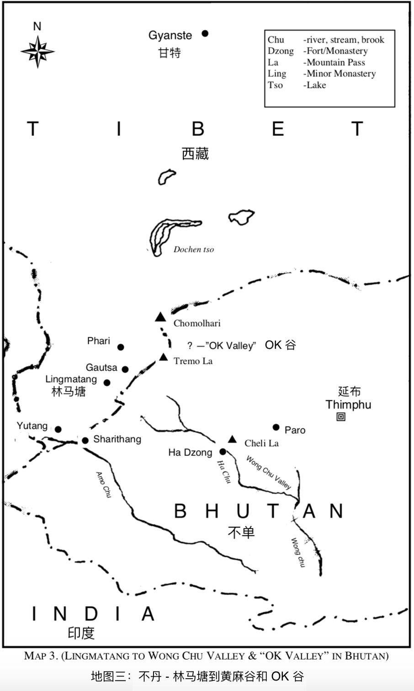

# 第四章

（4.1）

清晨我醒来，仍然能感觉到昨晚的音乐在我身体里萦绕回荡。 格什·仁波切选择的门德尔松轻柔的音乐旋律依旧在我体内流淌，是一种更深的自由感。

他也起的很早。那是夏天，他告诉我他很少会错过清晨的日出。太阳还没有升起。阳光刚开始映射在万年积雪的山顶上。

我们俩坐下来看着光线的颜色由绯红变成更浅亮的色彩。世上没有比西藏日出或者喜马拉雅山的日落更辉煌的景象了。

当太阳升起时，冰点之下的冰雪变得晶莹剔透，光线从中反射出来。彩虹般的色彩开始在深蓝的苍穹里显现，太阳从深红色渐变成浅橙色。天空褪去了深蓝色的背景，闪烁的星星也消失了，明亮湛蓝的天空渐渐显现出来。

我被这美妙的景象迷住了。然后格什·仁波切打破了宁静。

他说：“你知道音乐是有色彩的，如果我们能听到色彩的和声，它会是一曲完美的交响乐，是星空的音乐。”

我回答说：“是啊，伟大的音乐家们就是生命的显化。” 我想把他引到这个话题上，而他也一定读取了我的想法，说：

“我的孩子，今天早上我想和你谈谈音乐。你知道这也是你学习的一部分。不只是音符的组成，更多的是音乐创造和治愈的价值。”

我说：“这太棒了”。他闭着眼睛，就像平常谈论生命更深层的东西时一样，声音柔美，仿佛他自己就已触碰到了音乐的源头，他开始说：“美妙的音乐是宇宙韵律的变调，是生命智慧的显化，生命智慧在内在创造了一切，在那之外别无他物，它的本质是无限，地球也只是它其中的一部分。大地的灵魂以光、声音和色彩，带着韵律展现着创造的精彩。”

他继续说道：“音乐是无限的韵律声波，通过生命的创作表达着生命，人类就是这类表达的最佳乐器。那些光、声音和色彩的韵律声波总是和谐地流动着。任何不协调的音符都不是来自创作的源头，而来自于人们的无能 - 无法展现出这完美的韵律。”

此刻我感到自己与此完美的韵律同频了，可以听见仿佛来自远方朦胧的声音，不是来自地球的音乐。我感觉自己触碰到了上师长袍的下摆，可以听见他所听见的。他停了下来，仿佛也在听这光、声音和色彩的完美融合，这不是头脑能够想象的，只有与此同频的人才能感受到。人的头脑是无法产生这种声音的，因为那是永恒在说话。

“是的，”他继续说，“鸟儿、森林中的树木、河流、山脉的歌声，都有他们完美和谐的韵律。我经常在这种和声中徘徊，并在内在感受到同样的创造韵律。这样，我可以与自然万能力量的韵律融为一体，并学会控制它们，因为它们也是我的一部分。“

“通过这种方式，在这些高山的寂静中，我学会了鲜为人知的自然力量的魔力 - 我可以向你们的科学家们揭示他们了解甚少的原子结构的知识，这会带来更多关于宇宙力量的科学发现。“

“当我与韵律同频的时候，我能跟小鸟一起歌唱，野生动物不再野蛮，甚至高山也能跟我对话，我可以弹奏我最喜欢的乐器 - 小提琴，让所有人沉醉，不管发生什么我都不会抗拒这种流动，韵律就像是我的一部分。”

我心想这很新鲜，我并不知道他会拉小提琴，我得请他为我拉奏一曲。后来我真的这么做了，我从来没有听过这样的音乐。那是没有被谱写的乐曲，我以前从未听过、此后也未听过如此完美的旋律；那是他自己的作品。

他停了下来，他对我的思绪很敏感，我知道他知道我在想什么，然后我就笑了。他接着说：“就像思考先于提问或行动一样，宇宙音乐先于感觉和演奏，而正是这种感觉激发了演奏的表达。宇宙音乐会为同频的灵魂演奏。灵魂是内在的生命表达自己的竖琴，根据你内心圆满的程度，它的和弦会通过你、在你身上显化。这就是为什么你必须学会爱一切，因为生命就是一切。全心全意地热爱生命，就是像爱你自己一样爱你的邻居。这样它才能在你的内在和你对话，并通过你表达，在你身上没有什么是不可能的。你提出的任何请求，宇宙都会很快地实现。最重要的是，你的身心将和谐相处。”

他说：“你越是和谐，你就越能接纳，你的灵魂和身体就越能表达出在你内在的生命，是生命本身的运作产生了完美。因此即使多年过去了，你的身心会依旧强大；永远存在就是永远存在，生命是永不衰老的。“

（4.2）

我突然意识到他是如何保持身心年轻的了。他再次停了下来，即使我一句话也没有说，但他貌似能够听见我的思绪。他说：“是的，内在是什么状态，外在也一定是这样的状态。”

然后他继续说：“韵律和表达是音乐重要的因素。没有韵律的演奏就像是色彩没有调和，但韵律会让和弦与演奏鲜活起来，就像是所有色彩完美的调和，犹如光谱中所有颜色完美的融合在一起。正是这种融合影响着正在聆听着的灵魂们。”

貌似一个念头正在他的脑海中浮现，他补充说：“稍后你会听到更多有关此的信息。”

我本来要说点什么，但张口无言，他就继续说道：“完美的节奏如潮起潮落，没有任何东西能够阻挡其流畅而规律的力量。因为无限的创造力就在完美的韵律之内。造物主及其创造是一体的，没有分离，我们也不会与生命智慧自我表达的韵律所分开。“

他解释说：“这种完美的韵律从北向南穿流整个地球，通过太阳和月亮形成两级，从东方升起，在西方落下。“

这个力量形成了现在的电磁力；它让地球保持在中轴上，并通过其磁场吸引力将所有东西吸附在其上。如果这种电磁力不再存在了，那么其他磁流将以极快的速度吸引地球，然后将它分解成最初产生它的原子尘埃。电磁力蕴藏着（更多）关于伟大发现的秘密。”

他说：“完美的韵律会让你容光焕发；它会让头脑警觉，身体结实。这就是为什么我们在疗愈中会使用音乐。这样头脑就能摆脱分神，而分神也是紧张焦虑的原因，然后自然力量就有机会协调体内的每个细胞。此后心身就能成为完美和谐的电磁体。”

他继续说：“宇宙音乐可以说是生命永恒之心的韵律，像血液一样向外流动然后循环于身体的每个细胞，然后回到心脏，不断地再生。同样的生命的脉搏也如此在每一个活着的灵魂中穿梭。我们的精神和情感的自由就表达于韵律之中。”

他补充说：“如果生理机制处于混乱迷茫的状态，那么韵律也会混乱迷茫。你的思想和感受也同样会穿过细胞飞入外面的环境甚至更远。”

我自己想了想，“这就像一个广播电台一样。”

他说，“是的，整个以太被这些电磁波所磁化，让整个世界都能同时听到并感受到生命的广播站。东、西、南、北，上到平流层，下到地壳深处，它无处不在。 “

“我们在世界的屋脊，被称为枢纽的地方，我们的思想沉浸于生命的爱之中，我们可以通过与宇宙调频来帮助这个世界。

我对自己说：“格什·仁波切不仅向我展示了音乐是什么，同时还向我揭示了更深层的知识。”

他肯定再次读取了我的想法，因为他说：“练习是必不可少的，只有这样你才能掌控自己的乐器，但不要局限于自己的乐器。我听过用很好的乐器演奏出很糟糕的音乐，也听过用普通的乐器演奏出美妙的旋律，这也适用于个人 - 生命的爱是永恒的，没有人与生命是分离的。“

“没有两个人的演奏会完全一致，因为他们的感受各有不同。有些人看到是的乐谱上的音符，有些人感受到音乐在他们的灵魂里。” 他幽默地说，“糟糕的音乐有一点可取，那就是它不会持久。主导的和谐韵律会让它消失于虚无中，因为它产生于虚无，也本不是真实的。就像是加法计算中发生的错误，加法计算被修正后它会去哪里呢？它会消失于虚无中，因为没有它可以存在的法则。数学法则，就像和谐法则一样，它们就是存在着。“

他解释说：“色彩的混合是和谐的秘诀。你见过自然界中不和谐的混合色彩吗？没有！哪有这回事。声音也是如此，因为声音就是颜色，颜色就是声音，自然在光、颜色和声音中不断地表达自己。 “

“练习的时候，你得知道声音应该是什么样的。不要强迫自己；你的内在会告诉你什么是正确的。让你的演奏尽可能的完美，然后逐渐提升速度，直到你能够高速并准确地弹奏，且不会感到疲劳。你要记住，不能因为速度而影响韵律和音乐的表现。”

他还指出：“关于过度练习，你越是清醒鲜活的时候，动作就会越好。头脑会重复已做过的事情，因此错误的习惯很难被纠正。所以留一点时间休息是很好的，因为它让头脑有时间重新编排有意识的动作。准确度因此就非常重要。事实上你是在学习演奏的时候并没有在演奏，你只要给大脑机会，它就会起到它该有的作用。 ”

“你可能已经发现，休息后可以轻松地弹奏一个之前觉得有难度的曲子。这是因为当生理机能休息的时候大脑会进行调整。就像你要解决一个一度无法解决的问题的时候，你去睡一觉，醒来的时候就有了解决方案。当你给它机会，大脑就会自动解决问题。 ”

“在进行演奏的时候，你必须同时聆听和感受音乐，并让自己完全投入在音乐中。”

自我意识会扰乱这一机制。头脑同一时刻只能思考一件事情。当你想到自己，然后想到音乐的时候，你就在他们之间来回移动。克服这种习惯最简单的方法就是让自己沉浸在韵律之中。你很快就会发现，韵律会占据这两个有意识的头脑活动之间的空隙，然后内心就能开始自由地工作，至此你才是在真正的演奏。它全都在你的内在，在你练习的时候，你的动作，你的音乐，你的韵律都在你演奏的时候融为一体。平静如大洋深处，此时你就在展现生命完美的和弦。”

（4.3）

他继续说道：“永恒通过人性,向外展现,通过人性编织着生命韵律的网。永远不要模仿任何人。你必须表达自己的个性；然后你将拥有天才般的创意。"

“音符的融合非常重要。重音应该安排在乐句的开头和乐谱中第一个音符，并仔细聆听泛音，将其与乐章完美的融合。“

“在连奏中，在下一个音符启奏前不要硬生生的断开前一个音符；聆听泛音，并让音色或音质持续直到需要下一个进程。然后流畅地进入下一个音符，没有中断，因此无法分辨一个音符的结束和另一个音符的开始。泛音完美的融合能够让音乐充满和谐的韵律。"

我心想这是罕见的智慧借由语言表达了出来；我几乎感受到流畅的音律在内在流动。我学习音乐多年了，先是小提琴，然后是风笛。我的演奏还是相当不错的，因为在1911年的时候，我还获得了高地聚会的斯坦福桥冠军，我知道格什·仁波切说的是真的。他说的话就像音乐一样；他可能就是一直在演奏精美绝伦的曲子。

然后他继续说：“（悉心）观察进度和乐章，以便自然地进入高潮点，然后轻松顺畅地回退，进入下一个乐章；由此产生的韵律感，是少有机会听到的，一般只有伟大的艺术家才能做到。”

他睁开眼睛，说：“要我继续吗？” 在那之前我都没有讲话，我立刻回答说：“当然，请继续; 这是我自学习音乐以来一直期待的教导。”

我特别集中注意力，不想错过一个字，他可能也感觉到了。他回答说：“好，那我们继续。”

他接着说： “根据内在的感觉和解读，高潮点可以用不同的方式来演奏。 “

“例如在热烈的乐章中， 你可以逐渐加快速度并增强音调，每个音符都比之前的更加强，直到高潮为止，或者可以加宽连续的和弦，让最后的高潮在急促中提升强烈度而到达。”

“贝多芬使用的一种方式是叠加和弦，并且越来越强烈和不断升调，但预期的最终碰撞却不会发生。取而代之的是突然的极弱的和弦，那份意想不到的美妙和更深层次对内在神秘感的呈现，会让人惊喜而惊叹。”

有人问莫扎特音乐中最有效的演奏方式是什么，他说：“是没有音乐。”

“有技巧的停顿，让音乐在高潮中处于片刻的沉静，会让音乐充满更多内在的意义和美感。“

“你可以带领听众体验如翱翔翅膀般的乐章，让他们在高处停留片刻，然后在一瞬间展现出生命的永恒，接着再下降回落到乐章里——仿佛是回到普通日子里的感觉。”

我深吸了一口气，这真是音乐爱好者的一场盛宴；即使是那些已经达到艺术巅峰的人也能从中受益。当我在脑海中想象的时候，格什·仁波切继续说着，我不得不回神，以免漏掉重要的内容。我很幸运：拥有对我所感兴趣的事情过目不忘的记忆力，这些对话让人难以忘怀。我也很庆幸自己还做了一些笔记，记录了要点。

他停顿了一下说：“或者你也可以迟缓地表现连奏的旋律，延迟那最美的时刻的到来，增加期待感，然后当（高潮的）声音响起的时候，它会带来更精妙绝伦的释放，来满足你渴望已久的美感。”

“同样的，”他说，“你可能会达到高潮点，然后轻柔的徘徊于其中，但这种自由必须运用在法则范围内 - 也就是实现韵律流动的法则 - 平衡每个乐章、协调所有的乐章构成完美的整体。这就像两个灵魂在完美的爱情幸福中完美的结合，两个灵魂在那完整终极的狂喜中合为一体。“

“肖邦的手指在琴键上飞驰飘逸而美妙，创造出一种丝绒般温柔、含蓄、寂静圆润低沉的音色。肖邦认为至高无上的品质来自于触感的微妙，孕育创意的智慧，以及纯净的感受。对肖邦来说最大的罪过莫过于呆板枯燥、机械的技巧。”

格什·仁波切稍等了片刻，貌似在等我理解最后的几句话，然后他继续说：“在所有的演奏中，肖邦采用了一种摇滚的方式，旋律波动着就像是一支小船在起伏的海浪中前行，特别的引人入胜。这种特殊的演奏方式是他的特质，可以说是他的标志。他所有的作品都有这个烙印，也就是 “弹性速度“【1】演奏法。这种无视时间的态度就是他迷人的独特性所在，灵活且波澜起伏的动作，适度平衡的韵律:对此，他的同胞们对他想要传递的意境有着与生俱来的、直觉的理解，他们（的感受）伴随着（肖邦演奏时）空气中中和灵魂上的忧郁而起伏。”

格什·仁波切停下来思考了一下，接着说：“我读过关于肖邦的文章，应该是莫舍尔【2】写的，” 他接着说，“只有当你真实的面对自己的时候，纯净的表达和演奏才有可能。就是当你想要表达内心深层的东西时，必须有着清晰的想法、理解和行动。也就是说你的听众能否接收到你想要表达的信息和意境，取决于你自己有多敞开面对无限的智慧之流，取决于你对生命有多深刻的理解 - 即了知生命把我们所有联系在一起、我们与生命是一体的。”

我特别想说，正如舒曼所讲的：“演奏的时候，你必须与乐器融为一体，不能与之一起演绎的人根本无法真正的演奏。”

格什·仁波切补充说：“许多很有前途的人之所以失败的原因，是他们不知道造物主及其创造是一体的，不能分离。理解这一点是所有的关键，这不仅仅是一个观点，而是真正地去经历体验生命独特的声音，体验生命通过光、声音、颜色和形式来表达它自己。它就是和谐、爱、智慧和力量。在这之中就是生命在我们内在的力量，生命就是我们，‘我与（生命之）父是一体的【0】‘，‘道就是生命，生命就是道，道成了肉身【0】‘，肉身没有力量，道是不朽不灭的。我们并非生于血肉的意愿，也并非由人的意愿所生，而是生命的意愿。”

（4.4）

他看着我，仿佛要看我是否完全理解了他说的话，我很庆幸自己确实明白了。

他肯定地说：“那些在音乐中表达自己的人，应该记住生命为自我表达创造了完美的工具。 ‘就像生命之父一样是完美的。【0】’ 灵魂接收指引，思想和大脑指挥执行。如果你的头脑认为这执行的机制有缺陷，那这个想法往往就会显化，你越是想要有完美的表现，相反的念头就会越显著。这就是导致许多失败的原因。记住不断的练习要夹带休息，让完美的韵律与意识同化，这才能造就天才。你必须慢慢地练习才能掌控演奏。不要忽略困难的部分；刚开始的时候慢一些，然后逐渐调整速度，但要精准。要知道你天生本自巨足。“

“了解万物客观的统一性，忽略主观上人与人之间的分离，意识到自己跟万事万物创造者生命是一体的。爱你的邻居如爱自己。 “

“用充满爱的心演奏和歌唱，让它成为优美的旋律，生命会因为你与它融合一体而愉悦。”

我为他的了悟、智慧和对人生重要问题的理解而着迷。我坐在那里沉思着，然后听见他的声音，像是命令的语调， “起来吧，我的孩子，我们现在必须走了，还有很多重要的事情等着你，你必须上路了。”

“是啊，”我说，“但我想和你再呆一段时间。“

他回答说：“之后会安排的。但现在其他人还在等着你。在 Ok 山谷里的藏传瑜伽行者和上师们都已得知你已在路上的消息了，但我希望你先沿着哈楚山谷一直走到哈宗。沿途有八座寺院都靠得很近。 “

“这是给杨塘寺院长曾达成的一封信；他会把你介绍给其他人。他是 Tumo 瑜伽大师。我为你安排了所有的行程让你理解这门（Tumo） ‘科学‘。”

我说：“我听说过这门科学，能够控制热冷元素。”

“是的，这很有趣，但它并没有揭示真正的实像，但我还是希望你能了解，也许你能学会点什么” 他笑了。

他继续说：“在贡萨卡寺院，你将会学习瞬间穿越广阔空间的能力。这是通过明想中的悬浮来完成的。

你将在 Takohu 寺院看到心灵感应的练习。这是个非常有趣的领域，我希望你能特别关注，因为它以后会对你很有价值。” （这的确对我很有用，因为我在许多不同国家的时候，尽管我不会说当地的语言，我依然能够读懂人们的意识。）

“这会耗费你一个月或更长的时间。”

我问：“那我的朋友呢，他会跟我一起去吗？”

他回答说：“不，他会在 OK 山谷等你。”

第二天我阅读了所有能帮助我旅途的指引，跟格什·仁波切和我的朋友告别后，我就正式出发了。我带着我的挑夫、翻译、保镖、我们的马和一头骡子，其余的都留在了林玛塘，因为会途径那里返回。我现在正朝相反的方向行走，远离拉萨的贸易路线。我现在正前往将不丹与西藏分隔开的喜马拉雅后山。有人告诉我这条路只是一条小径，非常危险，有许多山体滑坡。

雪豹也在该区域活动。这种动物看起来像是老虎和狼的混合体。他们捕食高原山羊，并且非常敏捷。众所周知它们会在危险地段袭击途径的旅行者。旅途中我们的确看到了几只，但它们离得非常的远。游牧民族 - 居住在平原上的人们 - 他们养了许多马士提夫獒犬，以保护牲畜免受掠夺者的袭击。

我们穿过湍急的阿莫楚河，来到一个名为葛岭集市的地方，那里是居民交换物品的地方。人们基本不用钱，而是以物易物，似乎非常有效。我们穿过集市，然后一直走到春比谷底端的一个名为沙瑞塘的地方。

亚东位于春比谷的中部（我在上一章中提到过）。要到达拉萨，你必须往左，但我们向右拐了。春比谷在每年这个时候（5月和6月）都盛产野花。从山腰到山谷边缘开满了盛放的杜鹃花树。红的、粉红的、白的和紫的不同的颜色形成了一副绽放的画面。杜鹃花树蔓延到谷底的地方有许多大型的中国罂粟，每棵直径至少五英寸，茎高约五英尺。花瓣是浓郁的暗黄色带着粉边，看上去真的很漂亮。

我对翻译说：“要在伦敦这可是一笔不菲的财富，而在这里他们迅猛的生长，没有人想要它们。”

山谷的地面覆盖着野生乌头属、野生龙胆属性和飞燕草【3】。 这是一种在本草治疗中广泛使用的植物，尤其是用于各种类型的炎症，是顺势疗法中被认为最有效果的药物 - 著名的乌头属。龙胆属特别滋补也健胃。在这人烟罕至的土地上，这些植物多的能用车载。

当我们离开山谷时，我们踏上了我所见过的最崎岖险峻的道路。有些地方的宽度不超过两英尺，沿着陡峭悬崖的边缘直下一千多英尺落入下面的哈楚河。往下看就让我头晕目眩。有一处我们从一个大岩石下走过，它正好从小路上突出出来；有几千吨重。我在它下面来回走了几次，只是为了体验那种刺激感。

我觉得这里很可能发生过山体滑坡，因为岩石悬在半崖上。但是它是怎么扒住了山体我就不得而知了。也许有一天它会掉入一千英尺下的河床中；如果是这样，它将发出雷声般的轰鸣声。

我们不断攀登直到山口的顶端，可以看见远处的黄竹谷。前面能看到哈宗，点缀在山间的是那些寺院。

对我来说，看到如这么多大型寺院彼此毗邻坐落在山坡上，是一种崭新的体验。

下山比上山更费劲。步道的底部通向黄楚河谷，哈楚河也会流经。我们在那儿遇到了不少骑着毛绒小马的藏族人。

我对保镖说：“这些家伙看起来像土匪！” 他说：“他们就是啊”

他们人数比我们多，大概是五比一的样子。他们慢慢地靠近我们，准备跟我们打架，但我知道这是自杀的行为，但我内心觉得有办法克服我们的困境。

这些强盗认为土匪是绅士职业，并且鄙视任何其他类型的“工作”。他们开始遍历我们的物资，看得出来他们打算夺走我们所有的一切，包括小马。这会使我们陷入一个非常尴尬的困境，就在我束手无策的时候，突然间我想到了我的人造眼睛。我知道这些人非常迷信，而且我对他们的宗教也有所了解。

他们最害怕的神灵之一是只有一只眼睛的白神，这是一个给激怒他的人带来灾难甚至死亡的神灵。因此这些人定期给他供奉各种祭物，以安抚他的愤怒。带着这样的知识，我径直走到了他们中间，发出一些奇怪的声音，用藏语呼唤七级地狱在他们脚下开启。我取出我的人造眼，展示给所有的人看，然后再放回去。你可以想象他们的脸色！他们睁大了眼睛，在恐惧和颤抖中，甩下了我们的东西，然后骑上小马逃走了 - 我们只能看到尘土飞扬。当我们意识到人造眼的作用的时候，大家都笑翻了天。我们此后再也没见过他们。但我们后来听到了一个关于白神从山上下落到黄竹谷的奇怪故事。他们把我当成了他们所恐惧的愤怒之神了。

我没让这个人工眼的秘密泄露出去。给这个故事增添了神秘色彩的是，有位游客，一个十九岁的小伙子不幸跌落到山腰，肩膀脱了臼。我正好在那把他治好了。他的肩膀脱臼了大概半个小时，所以很容易就复位了。这次事件给 “白神” 带来了额外的名声，在我回到林玛塘后我听说了这些故事，连格什·仁波切都向我打招呼说：“我的孩子，你在这个国家这么短暂的时间，名声都要比我大了。”

我们一起畅怀大笑。

【0】引用自圣经的话语。  
【1】弹性速度演奏法（Tempo rubato）：被 “抢走“ 或被 “偷走“ 的时间；为了音乐表达时快时慢的演奏。  
【2】伊格纳兹·莫谢莱斯（Ignaz Moscheles）波西米亚钢琴家和作曲家。  
【3】翠雀属（Delphinium）毛茛科下 250 多个品种里的一种花草。

