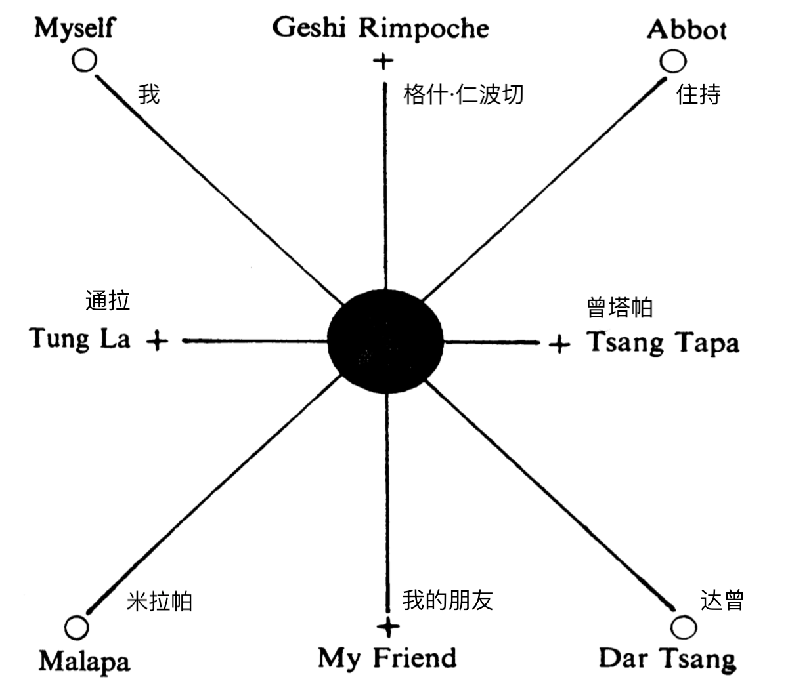

# 第九章

（9.1）

我们每天继续训练，直到我的头脑像水晶一样透彻。每天都能感受到能量越来越强大。空气清脆而晴朗，我们之间没有任何不和谐的想法或感觉。我们每天训练，直到我们感到有点疲倦，但又不过度劳累，因为那样反而会阻碍进度。 

最终，我到达了可以自己工作的阶段，这是我培训结束前重要的里程碑。

格什·仁波切安排了一场会面，我并不知情，他带来了阳塘的达曾，贡萨卡的格什·米帕和来自塔考湖的格什·通拉。这样我们就有八个人了，这么一群人，什么事情都有可能会发生。 

我看到格什·仁波切正在与曾塔帕（预言师，也就是灵媒）在交谈，我预计今晚会有一场真正的通灵会。实际上他们早已安排好了，是要给我一个惊喜。但我现在可以像说话一样轻松地读取他们的意识。由于这几个月的强化训练，我已然成为了专家。 

晚饭是特别为我们准备的，在住持的住所里用餐，他的住所很大，有一个长方形的大房间，里面有一张长桌，他的学生们都围坐在那儿。这也是一个完美的餐桌。我们的对话都很生动，有些是用藏语，有些用印度斯坦尼语，有些是英语。我对英语和印度斯坦语都很熟悉，藏语我也能听懂不少，一有机会住持就给我上一课。他是一位很棒的老师，知道所有把单词组合起来的简洁的方式。藏族人会使用很多丰富的词汇。当他们这样做的时候，我就会去读取他们的意识，对于学习语言来说这是致命的，因为要学会一种语言，你必须用这种语言思考，而不是试图去读取意识。读取意识的时候，你是不会听每个单词的，否则你的大脑接收就会失真，就不能读取意识了。

当我的朋友毫不含糊地谴责了当今所谓的宗教隐士的时候，这生气勃勃的谈话中有着一丝寂静。 

他说：“当今的隐士已经沦为了无用的、被蛊惑的信奉者了，因为事实上，已经没有喇嘛们知道乔达摩【1】和米拉日帕的真正的教导了。他们在仪式中长大，对人们内在的力量一无所知。“ 

“曾经有一段时间，伟大的上师们会挑选合适的候选人，经过一段时间的培训，他们会远离世人烦扰，以获得自我启蒙并开启藏族瑜伽士的力量。但我们今天有什么呢？信奉者们对瑜伽的知识和科学一无所知。“

“这些喇嘛只是在愚蠢的闭关独处中浪费生命，让精神和身体都变得更糟糕。他们一无所获。他们的隐退只是宗教仪式的一部分。” 

我问：“那他们会做什么呢？” 

他回答说：“在喇嘛训练的过程中，他本该有一段时间是在关禁闭之中度过的，但是如果没有训练，那简直就是愚蠢的。（关禁闭）通常为三天、三个月或三年。“ 

“起初他们会隐退三天，然后三个月或三年。他们可能会在进入终身禁闭前出来一次，然后就会被关在一个完全黑暗的小屋中，他们的头脑思想也是黑暗的。小屋一侧有一个小的排水孔，上面覆盖着石板，用于日常排泄。小屋的另一侧有一块只能从外面移走的石头，每天会有茶水和糌粑从这里推送到里面，拿食物的手必须戴着手套，因为不能让光照到身体的任何部位。“ 

“这些被蛊惑的信奉者，许多在终身禁闭结束前就疯掉了。他们身心受到摧残。他们没有受过训练，也不了解藏族瑜伽士的技艺。他们的生活完全是被浪费的，而一无所获。”

“可是，”我冒昧地指出，“有些苦行僧隐居在山里或在一个僻静的地方，在那里发掘发展自己的特质。” 

“当然，”他说，“但首先他们是由瑜伽大师们训练过的。那些从寺院出来的，只对仪式有所了解的人是堕落的人，只能承受隐士生活里物理的部分。他们滥用了大师的仪式，因此也无法发展他们的灵性特质。” 

格什·仁波切随后发言。我可以看到他闭上了眼睛，进入了心灵主体状态，他的声音音色令人着迷。 

他说：“朋友们，我既不谴责宗教，也不谴责追求实相，但是有仪式、要背诵祈祷文、重复咒语、引用《薄伽梵歌》或者《圣经》的有组织的教条主义，都不是宗教。称自己为喇嘛、佛教徒、基督徒、印度教徒或者遵循某种仪式，你能找到真理吗？我觉得不能！在这些影响中，你会陷入有组织的信念网里，它们是毒药让思维变得愚钝，它们提供了一种逃避的途径，从而使思维变钝且无用。” 

没有人说一句话，因为每个人都知道当格什·仁波切这样说话的时候，这是生命的智慧（在表达）。 

（9.2）

他接着说：“你被整个权威、牧师和 '宗师' 制度所束缚着。你不了解自己，所以你只是一味的接受，而不是询问。因为你的曾祖父做了一些仪式，如果你不这样做，你的母亲就会伤心哭泣，这绝对是骗人的。因为你还依赖于他人，所以你会有所恐惧，无法发现什么是虚假的，而当你不知道什么是虚假的时候，你也无法知道什么是真实的。“ 

“你可以谈论神，并重复他的名字一千遍，但这不会揭示真理。当你陷入自己的偏见和恐惧中的时候，真理是不会出现的。无论是东方还是西方，人们自己的的无知导致了这种有组织的宗教的出现。因为人们很迷茫，他想要有权威（来引领）。” 

没有人讲话。格什·仁波切准备要说非常重要的内容了。

他继续说：“因此人们创造了权威，无论是政治还是宗教，你都遵循它的指引，希望找到真理。“ 

“你通过别人的权威而了解到的实相，那并不是真理，而你也并不真正的了解。实相是未知的，你怎么能够通过权威去追寻它呢？当你寻求权威的时候，你就对自己失去了信心，因为你只是一个模仿者。因为你失去了信心，所以你才会创化所谓的引领者。你阅读了所有你可以找到的圣书。你追寻不同的理念他们都相互矛盾，你越是去模仿，对自己的信心就越低，而你只会将自己的人生变成了一本复写簿。” 

我知道这给我和住持都上了一课，事实上我们所有人都会从中受益。 

他继续说道：“你们从小就被告知要阅读什么和做什么。不允许你们独立思考。要找出你迷茫困惑的原因，你必须对自己充满信心，必须对我们的内在有很深的笃定 - 知道什么是虚假的、什么是真实的。但是你并不知道，因为你从未询问过自己是如何获得这些信念或概念的。“ 

“在迷茫困惑中，你觉得自己能够通过阅读《奥义书》、《薄伽梵歌》、《圣经》或任何其他书籍找到真理吗？当你自己感到迷茫困惑的时候，你觉得自己有能力读懂其中的真理吗？你所读的内容只会反应出你自己的困惑、喜好、厌恶、偏见和条件反射。“ 

“当你了解自己后，了解你的偏见、概念和信念的时候，真理就会显现出来。真理会来到你这；而你无需去往真相那里。真理就是（真理）！你无法创建它。“ 

“当你认为自己要去往真理的时候，这仅仅是你自己条件反射的投射而已。然后，这就变成了一种自我催眠，它也是一种有组织的宗教，而且无法就此得出关于真理的结论。“ 

“当你从所有的头脑制造中解脱出来的时候，你就会找到并非头脑的东西。在找到真实之前，头脑必须停止制造。

这样，你将不会属于任何有组织的宗教，同时也不会谴责或批判，也不会成为无神论者，因为那（无神论）也只是另一种形式的信仰。“ 

“要找到 ‘真正的自我‘（Real Self），你不能创造一个关于它的概念或观念，也不能将其与他人分离，因为实相里没有分离。只有了解隐藏 ‘真正的自我‘ 的那个小我，虚假才会消失。这样，生命的荣耀，生命的爱、智慧和力量才会彰显出来，因为生命永远存在，永恒不灭，而并非你所创造的。” 

他再次睁开眼睛，看着我，然后看着方丈。 

“不要追求权力会给你带来什么，否则你将失去 ‘真实‘。当你拥有 ‘真实‘ 的时候，你就拥有了一切。你无需发展 ‘真实‘，而 ‘真实‘ 会让你成长。因此，‘活在当下‘ 吧！因为只有在 ‘当下‘ 你才是真实的，真实不在过去或未来。如果你 ‘当下‘ 不是真实的，那么你永远都不会成为真实的，因为只有 ‘当下‘ 才是真实的表达。” 

此后没有人讲话。我们至少沉默了五分钟。 

月亮升起来了；是满月，从山后爬出来。它发出微红的光，当它升得更高的时候，就变成纯银白色和透明的。山脉的阴影呈现在下面的山谷中，而卓木拉日康峰的山顶则反射出月亮的银色光芒。这是一个完美的景象，在一个完美的夜晚，空气仍然清脆、晴朗。感觉好像古老的上师们就在我们的身边。这种感觉是一种令人兴奋的期待。格什·仁波切打破了沉默，他说：“我们现在有一个完美的圈子，最纯粹的氛围，这为我们朋友今晚的来访创造了必要的条件。曾经我们所有人 - 除了我的孩子和住持 - 都聚集在我的圣所，但是现在我们有了完美的组合，让今晚实现物化（materialisation）。能够让我们的朋友以他们自己的声音与我们交谈是一件很棒的事情。” 

（9.3）

他对我说：“你将体验没有死亡这一事实，它将不再是一种信念，而是一个事实。我们并不需要一场演示来说服自己死亡并不是真实存在的，但我们会非常享受有我们朋友们的陪伴，就像你跟在世的朋友聚会一样：不仅是那些离开肉身的人会来，还有那些仍旧在肉身中的人也会来。“ 他再次转向我说，“我的孩子，对你来说，这将是一场崭新的体验。”

我说：“也不完全是的，因为我以前在身边见过你。” 

“是的，确实如此，但就像我现在对你讲话那样，能看到并与我们其他的朋友交谈会是你从未尝试过的一种体验。” 

“确实是，那真的太棒了！”我大叫。我渴望快点开始。 

住持房间的门通向阳台，面朝山谷。格什·仁波切把门打开。 

我说：“你不需要黑暗来实现物化吗？” 他回答说：“哦，不，我们不需要黑暗。在月光下，你会看到与在白天一样清晰的画面。” 

我说：“在西方，他们需要在黑暗中进行物化。” 

他说：“是的，（因为）他们没有完美的组合，而且方法笨拙且不能令人满意。” 

我不再赘述，因为我意识到我已经见识过超出普通人理解范畴的力量，至此再有什么超出我理解范畴的东西也是正常的。

在各种场合下，格什·仁波切都显得很有经验，因为他都非常自信地安排所有的工作。首先，他下令将桌子放到一边。然后他按照他想要的方式安排我们的位置。他说：“为了达到最佳效果，我希望磁力不间断地流动以增强外质（ectoplasm - 外质就是灵媒物质）。那些仍在地球上或在地球附近的人可以相对轻松地展示自己，但是那些已经离开地球引力的人们，则需要一种物质，在该物质中可以减少他们光子体的频率，这样在我们物理的世界里，就能通过眼睛和耳朵看见和听见他们了。”

他让我们按照如下的方式坐好：我在他右边；他的左边是住持；他的对面坐着我的朋友；我朋友的右边是达曾，左边是米拉帕；然后是通拉，通拉的对面是曾塔帕。 

然后他说：“你知道在平面的四面是正极，” 然后他用粉笔在地上画了下图：

他画了 “+“ 的符号，在中间画了一个圆圈，然后将它们连接在一起；从中心圆他又画了四条直线，末端是一个小圆圈。他解释说：“ ‘+‘ 代表正极，圆圈代表负极，就像电的两极一样，少了一个电极，都不会产生相对作用力。”

他继续说道：“电流就在大气层里，就在我们周围；它处在模糊（非活跃）状态，直到两极相结合，它就在这个相对的世界里活跃起来了。” 

然后他把中心圆填满了。他说：“这是搅拌的容器，在里面形成外质【2】；然后它会扩散开来，包围整个房间，一直延伸到门口，房间的墙壁将它围在一起。” 

“现在，”他说，“当我们准备开始的时候，以太世界中的 “化学家“ 们就会来到这，他们将使用自己的公式来调节外质的密度以实现物化。 “

“这种物质的总体形式来自于我们的磁场体。它原始、厚重、而且无法使用，但是当它被以太化学家们调节后，就会成为完美的材质，然后我们周围的这些看不见的人们，就将会被看到和听到。” 

他说：“当然，它远远比我所说的要复杂。这是一门尚未被真正理解的科学；尽管你们的科学家们正在研究物质的结构，但他们还没有认识到电磁力是所有形式、以及实际上所有宇宙原子结构背后的力量。电磁力的减慢使物质的结构从最高层次的以太变化到最底层度的物理结构，这中间没有分离；你分辨不出来哪里是一个层次的终点，哪里是另一个的起点；它是同一个无法分割的物质。“ 

“如果我要举一个例子，一个粗俗的例子吧，就像一块坚实的沥青，往上加热，它就会逐渐失去坚固性。这个逐渐溶解的过程从固体开始，直到变成液体为止，你无法找到从固态转化成液态的分割点。如果继续施加更多的热量，它就会其达到气态，从固体变成了看不见摸不着的形态，同样无法找到任何的分割点。 “

“从有形到无形乃至超越形式，都没有分离，从无形到有形，也没有分离，而支持这种变化的内在的及贯穿始终的是一种不变的基本物质，始终保持稳定。而超越形式和内在的 “创造力“ 就是使用这种物质来创造形态的。这些形态又变回原来的基本物质，并且保持稳定。这就是创造和瓦解；他们是同一种力量，而不是分开的。”

“我们不知道的就是 ‘未创造的‘，‘未创造的‘ 本身就是创造力。”他继续说道，“而且这个 ‘未创造的‘ 就在你的内在。你可以识别生命里所有相对的东西，但不能识别它本身，因为它会识别自身以外的东西。“ 

“你是说不出来你的意识是什么的，你可以试试看，然后你会发现意识总是在识别与其相对的事物；它无法识别自己。但是当所有相对的都被理解和了悟以后，‘未知的‘ 才能被体验。它无法被知道，因为已知无法知道 ‘未知‘；因此，已知的并非 ‘真实的‘，‘真实的‘ 是 ‘未知的‘，也不可被知道。但当你达到了（已知与未知）的融合点的时候，就会有意识和创造力；完整的创造力就在这个（融合）点之后，而生命就通过你在这个（融合）点显化出真实。这就是生命！他就是整个（生命）工作的（融合）点。耶稣说：‘是（生命之）父一直住在我的内在，是他在工作着。‘”

\(9.4\)

然后他看着我，并继续说道：“因此，当你达到创造力的时候就是证据；此时你就会意识到所有相对的事物，因此你也知道他们没有创造力。创造力是你我内在未被创造的，所有创造力都落在（融合）点之后。“ 

“今晚我们将在这里目睹奇迹般的现象。这不仅有趣而且很有启发性；这将让我们最接近信仰 - 让我们认识到我们是一体的，生命之父的爱和手足情谊。人们对分离的信仰，对权威的信仰，对权威的追逐、人们的自私，以及对灵性和物质利益的执着渴求，所有的这些都将在真理被众所周知后消失。“

“我期待有这么一天，这片土地将摆脱愚蠢的迷信从而获得自由。我相信，凭着对超自然技术的掌握，如果我们摆脱了迷信，我们可以带领世人到达光明永恒的真理 - 生命之父的爱和手足情谊。"

“我们并未像在西方那样把时间浪费在唱歌、祈祷或演奏音乐上，我的孩子”（他对着我说）。 “但我们已经获得了建立外质所需要的和谐，同时你们通过听我说的话也获得了启发。” 

然后他指示道：“现在把注意力集中在中心圆，你将看到外质的形成。” 

果然在那儿形成了一片白色云团。月亮光清晰地让它显现出来。它开始在我们头顶旋转。我们似乎被笼罩在其中。最终它像白云一样充满了整个房间和门口。实际上我们就像被云层笼罩起来一样的感觉。我觉得自己从地上被传输到云层里，然后不久我们就能跟那些远古的上师们和已经离世的亲人们交谈了；还有一些仍在肉身里的人们也会来到这里和我们交谈。 

文字无法描述这整个精彩的演示。伟大的米拉日帕是第一个讲话的人。他用藏语、印度语和英语三种语言跟我们对话。 

他说：“我来给你进一步的启示。你试图掌握的神秘力量并不是真实的。真实是超越一切的，真实的精彩如果我用语言来形容就只能创造出关于它的概念。但是这远远超出了人们对它的理解。有太多的垃圾知识和胡言乱语被传授给人们，这些都蒙蔽了真理。例如你所相信的轮回就远非真理。“ 

“你相信已故的达赖喇嘛转世到了现今的达赖喇嘛。但这不是事实。如果伟大的佛陀转世回来，他肯定不会被你们的仪式和胡言乱语所束缚。他伟大的智慧将在他的行动中得到体现。但是你们找到了什么呢？一个只有儿童级别的智慧和理解力！你们宗教所说的轮回都是骗人的，让每个人都蒙受恐惧和无知的迷信。

"我告诉你，‘真理’ 跟现在所教导的完全不是一回事。现在所教导的真理绝对是捏造的事实。你们宗教所宣扬的，上一世达赖喇嘛并不在这一世达赖喇嘛的肉身中。我希望你能认清这仅仅是一种信仰，而不是事实，更不是真理。“ 

“轮回是存在的，但不是你所理解的那样。合一的生命的灵魂 - 是存在于现任达赖喇嘛的内在的，它也一样存在于过往每一任的达赖喇嘛的内在，但现任达赖喇嘛并没有意识到这一 ‘真理‘。每一个人的内在都拥有同一个生命的灵魂，只有认识到这一点，只有通过知道什么是虚假的，才能让生命的智慧和力量展现出来。“ 

“我希望你能带领人们远离愚昧无知而导致的自我催眠。我是用现代的语言与你交谈，以便你能够理解我的意思。” 

他对着格什·仁波切讲了很长时间，我听他说：“你必须谨慎行事，以免阻碍工作的进展，因为许多人还没有准备好接受和理解生命跟所谓的死亡并非分离的。只有一个生命，而生命是永恒的。我会你完之后还会有其他人来给你说话。你的朋友凌士拉隐士今晚也在这里。” 

米拉日帕似乎是星体世界的指挥，而格什·仁波切是物理世界的指挥。 

来了许多人，当他们到达门口的时候，就变得可见了。这真是一个奇妙的景象，一个奇妙的经历。我以前或至此以后从未见过类似的东西。 

大约一个小时以后，亚历山大的圣安东尼和使徒保罗直接来找我了，我将在本章稍后分享圣安东尼所说的话。但我想先告诉你是什么让我相信这一切都是真实的，而不是我的想象虚假出来的。 

我的妈妈来找我了。我能看见她的形态和面容就跟她在世的时候一样，只是看起来很年轻，而且容光焕发。她用盖尔语【3】与我交谈来证明那就是她。“ 

“我是你的母亲；你的父亲也在我边上，还有你的朋友约翰·萨瑟兰。”

她说：“你正在做的工作让我感到非常的高兴，我们都在帮忙。” 她说的时候脸庞明亮而美丽，这仿佛给了她极大的快乐。 

这样过了六个小时，人来人往，这过中的细节就能填满一本书。许多仍在肉身里的人也来了，包括凌士拉隐士，这个格什·仁波切已经告诉过我了。 

隐士对我说：“你要来我的隐居与我同住。” 

格什·仁波切并没有告诉我这件事，但后来碰巧我确实得去他的隐居居住，关于这件事我将在另一章中告知。 

然后在快要结束的时候，最灿烂的光芒照亮了整个房间。它照亮了一切，就像阳光普照。光芒耀眼让我们不得不闭上眼睛；随后我们逐渐习惯了它，这光是生命本身。他给我们带来他的祝福。 

那些已经读完我的《灵魂与肉体的生命疗愈》的人，就能意识到我所说的是真实的；这是我在喜马拉雅山所有培训淋漓精致的呈现。 

这确实是我见过的最美妙的一次通灵会，也许再也看不到这样的场面了。 

那时我就知道物质与灵魂之间没有分离；使我们分离的仅仅是我们的无知。但是启蒙开悟正降临到这个世界上，不久所有心灵的黑暗将消失，那些拥有灵魂天赋的人们也将不再受到迫害。 

一种新的宗教正在进入这个世界，不是宗派宗教、不是教条或信条，而是一种揭示死亡只是进入永恒和永远存在的更高生命状态的一扇门，来展现在我们和那些离开肉身的人之间是没有分离的。就像耶稣这样远古的上师们一样，就像他说的，会一直与我们同在，直到世界的尽头。 

言语难以形容这种美妙而荣耀的启示。

我们讨论了各种技艺的科学。圣安东尼特别对我说了关于疗愈的事情。他是古埃及伟大的理疗师，而疗愈是他的伟大课题，他告诉我，正因如此更高的力量让他来帮助我的工作，他和其他的人们都将在我回到我来自的世界帮助我继续工作。

他关于疗愈的论述是专门针对我而说的。到场的其他人与在场的人讨论了各种各样的话题。 

显然整个通灵会的过程是完美的。尽管有十多个人同时在房间里，但一个人讲话的时候，没有人能够插嘴。

我对圣安东尼对我说的话特别感兴趣。我以前曾与他交谈过，但没有这么完整。 

他说：“生命通过人们来展示他的荣耀。” 我知道这些话语的含义，因为他以前曾对我说过这些。然后他继续对着我说话，好像房间里没有其他人一样。 

他说：“从一开始，人们就被赋予了疗愈和教导的力量。有些疗愈非常神奇，以至于人们的心灵无解它们。因此产生了怀疑态度，还以其明显不可能为由，否认这些惊人的蜕变。” 

他继续说道：“生命的疗愈成就非凡，而其他的方法都失败了，但人们并没有意识到生命强大的力量，因为思想/头脑无法参透超越它之外的领域。头脑只能根据它所知道的来推理，而对它所不知道的，超出理性的那部分则无法定义，但生命的疗愈就是发生在这个领域中的。” 

“是的，”我评论道，“许多人想知道生命的疗愈是如何实现的，看不见的事物如何完成这样一个完整而瞬时的改变，他们仍想要将其简化为一些词语，但这只会让头脑产生一个概念，而不是真理。”

然后，圣安东尼再次讲话：“任何现象都是通过智慧的法则而产生的，否则就不会有现象。例如，如果你恐惧任何事情或对任何事情有信心，那么就会有一种智慧作用于你的恐惧和信念，并按照你的恐惧和信念产生作用，这就是思想 - 行动的法则，或电磁活动定律，因为人体就是由能量原子组成的导体。

“但真理就像数学；它是精确的。当错误被发现和纠正后，错误就会消失。你无法告诉我为什么二加二等于四而不是五，你无法调研数学，就像你无法调研真理一样。你只能纠察错误。真理，就像数学一样，真理永远是真的，永远存在，永远不会发生改变，因此不会出错。这就是为什么生命的疗愈如此完美。“ 

“你可以调研在你周围运作着的法则，但这也是来自生命超出人类头脑的范畴而无法被研究的。“ 

“造成你周围混乱一片的原因是人们无法理解生命的基本原理。这种愚蠢让最聪明的人无法理解生命的法则就在自己身上运作着。“ 

“否认数学定律的存在是愚蠢的；否认真理法则的存在也是愚蠢的。你可以理解真理的法则，但是你不能说出真理是什么，就像数学一样。你可以使用真理，就像使用数学一样。音乐中有一个真正的音符 - 和声；没有虚假的音符，只有杂音 - 也就是非和声。“ 

“否认是无济于事的。否认虚假只是在认可它，但它并非真实的。但如果了解它是如何产生的，你就能看到它有多么的虚假。然后你就能明白虚假是由小我（self）产生的，而小我在实相里并不存在。当你看清虚假只存在于小我的时候，实相就是和谐应运而生。

“虚假总是试图抓取小我，因为那是虚假唯一存在的方式；因此才会有幻象。“

耶稣从未宣称自己拥有任何力量。他说：“是（生命之）父一直在我的内在，他自己在运作着。” 他也没有把自己当回事：他说：“仅凭我自己，我什么都不是。” 

“但是当你披上疗愈师的外衣，然后说：'我是疗愈师、或我是先知' 的时候，你就把自己局限于个人；这就是为什么那么多人都失败了的原因。小我掩盖了生命，所以你必须摆脱小我；小我是虚无的，你越早意识到这一点，对你和所有来找你的人都会越好。“ 

“对于那些视耶稣与自己和生命分离的人来说，耶稣似乎是一个外部的媒介，但这仅仅是因为他们不认识自己的真正的（生命之）父，因此他们也不认识他的（生命之父）。如果他们知道耶稣的（生命之）父也是他们的（生命之）父，他们本可获得自由。耶稣说自己什么都不是，只是因为（生命之）父一切才皆有可能。他知道他不能跟你我的生命所分离。因此他通过宇宙（生命力量）来运作，而宇宙（生命力量）又通过个人来运作。你必须学会做同样的事情。

那些陷入顺从和分离的人是很难意识到这一生命的力量的，但那些体验过生命力量的人有确凿的证据证明实相的存在。“ 

“当我向你讲述（生命）无处不在的时候，我的言语是相对的，我似乎说的是我自身以外的事情。但事实并非如此。我只能以相对的言辞与你交谈，来帮助你在自己的内在找到真相。” 

他继续说道：“我知道你已经理解了 ‘相对物‘，也能明白我的意思。上师曾说：‘你难道不知道我就在生命里，生命就在我的内在吗？‘ 所有了悟的人都知道是生命给予了他们力量让他们成为（生命之）子，这也向他们展示了意识的一体性，而创造力就在他们的内在。 ‘我看到（生命之）父所运作的，我也照着运作。’ “ 

“现在你该意识到疾病主要是由于某些原因和忽视了自然法则造成的。这是由于无知、恐惧、缺乏爱（缺乏给予爱），缺乏对一直在寻求爱的小我的理解而造成的。“

“疾病是一种表象，表明身体和精神已跟自然的韵律失去了平衡，而为了恢复这种（平衡）状态而进行的 '斗争' 就是疾病。换句话说，如果你继续忽略自然法则，而同时继续与 ‘不放松‘ （疾病在英文里是 dis-ease, 也就是不-放松的意思）进行斗争，那么思想的注意力就会集中在（疾病的）状况上，因为身体的感受反馈给大脑，然后大脑就被困于身体的感受里了。这时大脑就在挣扎着要挽救身体。正是这种挣扎致使原子失调和异位，导致疼痛和不适。一旦知道了这个真理，挣扎就会停止。“ 

“头脑能够意识到感受，而这种感受在头脑里就被登记为疾病。然后这种疾病被起了一个名字，以便头脑可以保存它。如果这个名字向人们传达了疾病无法治愈的意思，那么头脑也是会接受的，从而又增加了负担。只有当人们看到（疾病的）根源是自己对真理 - 对自己 ‘活着/存在‘ （Being） 的真理 - 的无知，和对自然法则的忽视的时候，这种负担才会消失，然后灵性-生命会根据自然的完美运作改变身体和头脑。” 

我说：“我可以很清楚地通过一个人身体异常的状况，看到这个人是对疾病有意识的。“

“是的，”他回答道，“当人体细胞发生紊乱的时候，令人不安的报告就会传递给大脑中枢，然后大脑有意识的部分就会认为自己身体状况不佳。因为没有意识到生命全部的力量，所以恐惧和忧虑就会来袭。当头脑接受了 ‘存在‘ 的 ‘真理‘ 的时候，大脑的中枢就会被告知；然后重构就会开始。但当头脑陷入挣扎中的时候，它就无法利用其第一防线 - ‘生命的理性‘，而接受了关于紊乱的报告为最终裁决。当你意识到你存在的真相时，真正的疗愈就会开始。有时头脑完全被真理充斥的时候，完全的蜕变会在瞬间完成。这就是生命的治疗。” 

我全神贯注地听他说着，对周围发生的一切一无所知，他没被打断继续说道：“疾病实际上是 ‘你存在‘ 这个真相在你的意识里消失了，然后身体抱恙的意识控制了大脑。这会让你失去快乐感，充满活力的感觉也会消失。支撑着身体的心灵思想会受到什么样的命运呢？真理会暂时离开头脑思想，头脑已然陷入了疾病是事实的幻象；头脑已然将生命对知识的主权交出，投降于混乱和迷茫的力量。” 

他补充说：“我是作为一个见过头脑放弃其主权的人才这么说的。“

他继续说道：“现在，有些人将药物作为康复的最终手段，而且由于康复并没有发生，人们进而接受了疾病的结果。但如果通过某种化学方式起了变化，让情况有所改善。那么结果就是对药物产生了的错误信念，如果疾病复发就会引起进一步的混乱；最终当患者发现药物不再有任何作用的时候，会导致进一步的抑郁和焦虑。“ 

“你必须认识到，身体不只是化学反应的结合；它拥有（更高的）智慧 - 专业的知识，一个了不起的维护身体机能的组织。这就是充满活力的生命的力量，是产生运力和蜕变的基础。 “

“自然疗法如草药、生化疗法、顺势疗法、水疗，在许多情况下作用于细胞结构并产生化学反应。这产生了很强的的心理暗示，促使头脑采取行动。这样的作用力会开始传播健康的意识，进而重塑身体内部的平衡与和谐。如果头脑只处于这种状态，但又不了解内在生命力量的法则，那么这种状态可能比第一种状态更糟糕。” 

他说：“你看，是小我被疾病所困扰。只有小我自己知道疾病的存在。生命对疾病一无所知。小我是自私的、孤立的、贪婪的、可憎的、带着仇恨的、对立的、记仇的和暴力的，这是大多数疾病的原因。“

“非主观的生命对这些事情是一无所知的，因此非主观就是疗愈。你越是非主观，你就会越有爱和仁慈，因为非主观就是爱，而爱可以疗愈（一切）。爱是生命，生命就是爱，爱是一切完美无反作用力的运力的基础。“

“当你发现自己的小我总是忙于外部的事务、忙于挣扎，忙于内在和外在的斗争的时候，你就能明白造成麻烦的根源；当这点被理解的时候，非主观的本我（inner self）就会被解放，然后辐射性的生命力量也会被释放。这些自然力量的电磁波就会让思想和身体蜕变。 “

“这种内在的原子作用为潜意识机制提供了强有力的（心理）暗示，由于强大的能量流向正确的方向，从而开始瞬时地作用于思想和身体，由内至外的清理，清除所有迷茫困扰。身心会因此得到解脱，挣扎结束后运力会保持正确的方向。

“随着迷茫和混乱的消逝，（你）必须放弃疾病这个概念，等平静之后身体就不再反馈（给大脑），从而和谐就形成了。” 

“一旦以这种方式建立了和谐，通过理解，无论是什么性质的疾病或持续了多久的慢性病，身心都会发生蜕变“

“在真正的引领指导下，患者开始意识到痛苦是暂时的和是虚假的，任何暂时的事情都是无常的，没有自己的根基。只有愚昧无知的小我才会陷入外部的事物。实相绝不是无知的小我。实相是非主观的本我，它是完整无缺的。” 

他说：“如果疾病是真实的，那它就无法被治愈，因为实相是不会改变的。小我是借助于恐惧的暗示而生于恐惧中的。对死亡的恐惧是人类家庭大多数痛苦的原因。那么消除这种恐惧是最为重要的。”

他强调说：“我想让你意识到，在活生生的宇宙里是没有死的粒子的。生命是不可能有死角的。生与死之间是没有区别的；正如你现在看到的那样，它们是相同的。他们只是永恒的生命从一个状态过渡到另一个状态而已。“ 

“生命会在其不断完善的居所（肉身）中继续发展，生命的个体意识会变得更加觉醒。因此你必须从头脑中消除对死亡的恐惧，以便建立永恒的生命的意识。这是对身心疗愈最大的帮助，因为对恐惧的意识会破坏这两者的功能，而对生命的意识则会恢复它们正常的功能。‘此世不要叫任何人你的父亲，因为你的（生命之）父是永恒的。’ 【0】“

“只有在对疾病和死亡的恐惧消失之后，才能实现身心的完美疗愈。但是你必须先了解自己，然后才能帮助他人。最愚钝的头脑也能被开明了悟的意识所渗透。” 

“请记住，”他强调说，“对于一个充满恐惧的人来说，咒语颂词是没有什么帮助的，反而时常会加剧关于问题/毛病的念头；因此你只是在创造对立面而已。你有健康的理念，却与不健康的观念对抗着。你有生命的理念，却与死亡的观念对抗着，你有善良的理念却与邪恶的观念对抗着，依此类推。“

“但通过娴熟、智慧的语言，通过理解，患者会变得乐于接受并愿意合作，然后变化就开始了，有时是瞬间发生的。“ 

“存在的真相这股力量会运作电磁频率震动直达患者的心灵，并开始打破束缚他的负面心理条件反射。通过这种方式，无论是近距离还是远距离的患者的心灵都可以被影响。在那一刻就被治愈了。 ‘孩子，不要担心，你的信念让你变得完整。‘ 【0】这些都是你熟悉的谚语，现在你知道了他们真实的含义。” 

他停了片刻，然后继续说道：“有了对你存在的真理的了解，你的灵气就被净化了，你的思想变得活跃起来。意识到自然里一切都于你无害，而你对所有自然的一切亦无害。当你不再恐惧自然的时候，你就能够从源头掌控自然，因为你已被给予了掌控万物的力量。

“看清小我的虚无，知道自己什么也不是，你的谦卑将成为生命完成其工作的管道。（你）只需松开刹车，剩下的就由生命来完成。“ 

“通过理解、而不是恐惧来获取信念。如果它来自恐惧，那么你是没有（真正的）信仰的，你就会陷入恐惧与和信仰的（二元）对立中。“ 

“培养倾听的意愿；减轻患者的（心理）负担也是有很大帮助的。“ 

“超越主观而成为非主观，知道生命是不受疾病或死亡、善与恶、成与败的影响的。“ 

“请始终记住，在治愈患者之前，你必须先治愈自己。我的意思是让你的心灵摆脱所有困扰和烦恼的元素。这样生命的力量就可以毫无阻碍地发挥作用。通过爱与智慧的灵性力量改变万物。请记住，任何一个令人不安的影响都像躲在头脑角落里的游击队，等待同僚们的到来，当他们聚集足够多的力量的时候，他们就会对毫无戒心的人们发动攻击并打到他。“ 

“这些元素会在无知中蓬勃发展。治愈的方法就是去理解。用你自己强大的生命理解之光而让患者的意识灵性化，这样当他自己的（生命之）光点亮的时候，就会在最黑暗的角落里发光，从而让这永不暗淡的光照亮身心。“ 

“世界是病态的因为个人是病态的。根源是迷茫和无知。剔除这两个冒名顶替者，生命就会显化于每个人，显化生命的荣耀，每个人就是按照生命的样子被创造的。“

“摆在你面前的任务看似很艰巨，但我们爱的无线电波将与你同在。你不要耽误了。一旦你完成了在这里的任务，就回到你来自的世界，并愿生命的全能光环环绕着你。” 

然后他离开了。 

我被这精彩的一堂课震撼了。只有一个了悟的人能像他那样讲话，我知道这是真的。他肯定讲了有半个多小时，但感觉相似一瞬间消失于永恒中，因为在那一瞬我就在永恒中。

                           ****                                       **\*   \*   \*   \*   \*** 

现在让我告诉你另一个事件让这次聚会如此真实。在我的母亲对我讲话后，我的挚友杰克·萨瑟兰说话了，他在 1915 年第一次世界大战中丧生。他总是用高地口音称呼我为 “莫多”；他来自高地，讲盖尔语。我们是多年的好朋友，所以我们谈论过去的时光并一起欢笑，而他回忆了以下的故事，只有我们俩才知道的故事。 

除夕夜在格拉斯哥，杰克和我喝了几杯威士忌。杰克很喜欢威士忌，但他喝不了太多。那天晚上，他醉的很厉害，呕吐的很凶以至于下颌脱臼了。当时我们正好经过西部医务室，我带他去了那里。值班医生是我的一个朋友，他当时很忙。这个时候，杰克情况变得严重了，他甚至无法说话。 

所以我对他说：“白痴，张开你的嘴巴，我来给你治。” 我将两个拇指放在他的后臼齿上，快速地向下推，然后单击，跟他的下巴接起来了。 

当他追述这段经历的时候，毫无疑问是真实的。他的额头是非常突出的，当时显示得很清楚。然后他试图给我一些建议，但有人让他闭嘴了。

聚会结束后，我们坐下来聊天；每个人似乎都容光焕发。茶水送了上来，我还剩下几盒亨帕饼干，大家都很开心，一直聊到天亮。

太阳升起时，我们出去看着日出从俊美的卓木拉日康峰山后升起。 

观看日出显然是喜马拉雅山外的大师们经常做的事情，但对我来说，这是我有生以来最棒的经历。它为我所见和所学的一切上封上了印章。 

我的朋友过来坐在我旁边，他说：“你在圣安东尼有个很棒很可敬的灵魂伙伴。” 

“是的，”我说，“我现在知道我有许多很棒的朋友，我很爱他们，也包括你在内。” 

然后他用胳膊搂住我的肩膀说： “正是生命的爱让我们大家团结在一起，履行了他的旨意。”

【0】引用自圣经里的话  
【1】乔达摩·悉达多（Siddartha Gautama）公元前560年-480年）被称佛陀 “开悟的人”。萨迦部落国王之子（因此也称释迦牟尼为“释迦之贤”）。佛教创始人。  
【2】外质（Ectoplasm）在这里指粘性物质，有些人相信这种粘性物质能从灵媒的身体发散出来，然后形成各种形态。  
【3】盖尔语（Gaelic）凯尔特人的语言，凯尔特人居住在苏格兰高地，另外一个分支包括苏格兰、爱尔兰和马恩岛凯尔特人。

