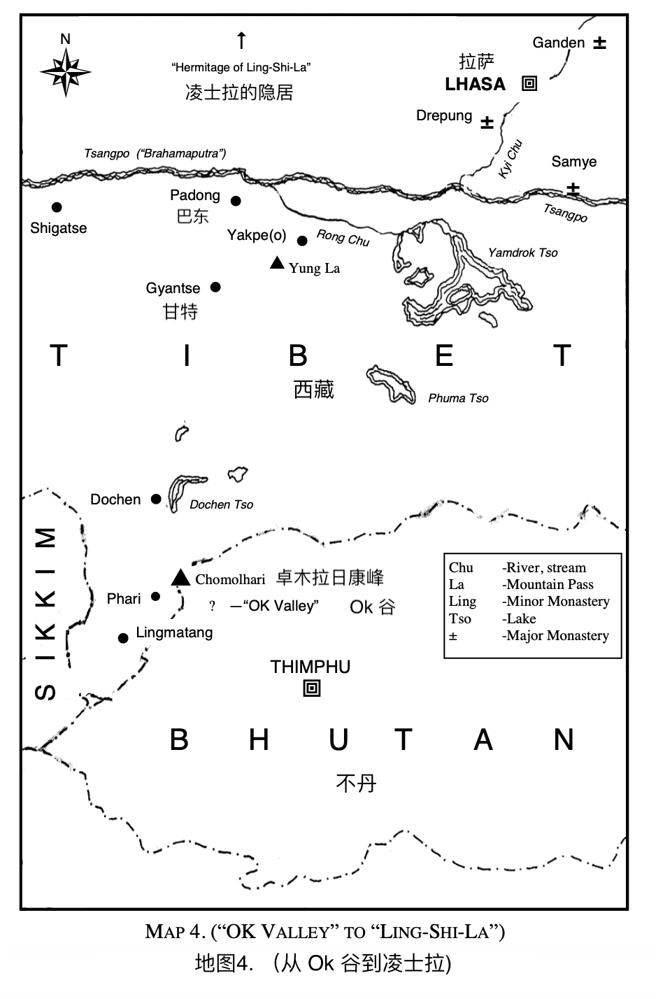

# 第十章

第二天，我并没有想象中整夜坐着的那种疲倦感。实际上我感到非常清醒，尽管我们只是做了让自己开心的事情。下午我躺下来休息，然后开始想起凌士拉隐士。我闭上眼睛，看到一片风景如画宁静的湖水，周围绿树成荫，蔓延到远处的山腰。在山脚下，盛开着高大的杜鹃花树，有些是粉红的，有些是白的，有些是赤红的。湖的中央是一个小岛，小岛上有一幢不寻常而迷人的房子，周围环绕着灌木和鲜花，这是我以前从未见过的。 

绿色的棕榈树环绕着房前绿色的草坪。我在想谁是这么美丽的地方的主人的时候，我看到凌士拉隐士在花丛间工作着。” 

我感觉到有人在我身边，我睁开眼睛，看到我的朋友在我身边。我告诉他：“我一定是去旅行了，因为我看到一个最美丽的地方隐秘地坐落于一个湖中央的小岛上，周围到处都是树从和美丽的花朵。当我想知道这个地方属于谁的时候，我看到了隐士自己在栽培他的花朵。” 

我的朋友回答说：“你刚刚拜访了隐士。你看到的地方就是他的住所。它位于遥远的藏布江之上，是西藏仍未开发的地区。他拥有世界上最美丽的地方，他自己亲自管理一切。你刚刚经历的就是星体旅行，隐士非常擅长这种技术。我会告诉你有关他的故事。“ 

“多年前，他曾在甘丹寺中做主持，并教授哲学和魔术。他已经研习星体旅行 - 就像你刚才那样 - 已经多年了，然后他发现了这个美丽的湖泊及其中的小岛。因此他开始寻找它。几个月后，他回来了并说：“我终于找到了我的家。” 当他告诉其他人在哪里的时候，他们说：“但是由于持续不断的飓风席卷，从来没人能进入那个山谷；而且也没有已知的路径可以到达那里。“

“他回答说：‘我已经找到了进去的路，我将在那建设我隐居。没有证据表明有任何有肉身的人去过那里，只有那些掌握了星体投射的人才去到那里，这非常适合我。我现在将完全掌握星际旅行的技艺。’ 进入山谷的路只有隐士本人才知道；除了他自己，还没有人实际去过那里。” 

“好吧，” 我告诉我的朋友，“隐士说我要和他在那呆一阵子。” 

他回答说 “是的，然后你将真正学习与众神灵交谈。我只希望我有幸和你一起去。” 

第二天早上，在沙发旁的桌子上放着厚厚的羊皮纸，上面有通往隐居的详细信息，还建议我应该带些什么。在我朋友的桌子上有一个类似的副本。这些指引都是在夜间神奇地被安排好的。 

我对我的朋友说：“这比以往都更加神秘啊。” 

他回答说：“对于那些掌握技艺的人来说，物质的东西是很容易被（超时空）转移的。这种技艺经过一定的发展，你就可以联络到已失去肉身但了悟转移术的瑜伽士。他们在西藏经常做这种工作。“

我说：“那么，隐士似乎可以把要求写下来，然后请这些灵魂瑜伽士运送它们？” 

“哦，是的，”他回答，“那是很容易的。他们知道物化和非物化的秘密。你已经知道了物质只是一种看不见的物质，但它可以被（转化为）可见。一切都在头脑中，没有所谓的物质。物质是你赋予看见的和感知到的事物的名称，但事物的名称不是事物本身。名称只是在你脑海中形成的一个概念，（概念）就成为来你认知事物的全部。但你会发现，隐士本身就是一名瑜伽大师，同时有灵魂瑜伽士相伴，他俩完全了悟各种物质密度的频率，因此可以将任何物品转移到任何地方。”

他继续说道，“一切都是头脑中的频震动，而意识则是控制的元素，隐士他有意识地知道如何提升物质频率，将物质频率转换成星体频率并将其维持在那里，因为他已经不受物质固态这个概念所束缚了。瑜伽士跟他一起工作，在他们共同的努力下，你看到的那张写着东西的羊皮纸在被提升频率并一直保持在这个状态，然后通过以太传输，而上面的书写和其他都完好无损；然后它就物质化了，你就可以看见它了。当你知道如何实现非物质化和物质化的时候，这就没什么神奇的了。” 

“是的，”我评论道，“我在贝利先生悉尼地一场通灵会上见识过转移术。实际上，我仍然拥有部分被转移的物品。” 

我的朋友说：“当我们跟隐士会面的时候，我们会听到更多的。他被尊为和米拉日帕一样伟大。” 

我说：“那我们什么时候才能开始呢？你知道我没有多少时间了，而且现在时间飞逝。” 

他回答说：“我们明天就开始。” 

我对他说：“我很高兴你能和我一起去，我觉得没你我是无法完成的；而且，独自旅行真的没多大乐趣，尤其是在未开发的西藏。” 

“我很高兴能和你一起去，”他向我保证。 “我们不会带太多东西；我们将轻装上阵，因为这会是个艰难的旅程。如果这很容易的话，其他人也会在那里。实际上，这是最难到达的地方。这也是为什么隐士会选择它的原因。” 

第二天我们就启程了，只有我们两人，因为我们要去很难到达的地方，也因为隐士不一定会欢迎其他人去到他的圣所。我们决定沿途备一些要吃的食物，旅程的最后一段就只能听天由命了。

我们在清晨启程去往甘赞。一阵阵咆哮的刺骨的寒风从被云层覆盖的卓木拉日康峰上吹下来。我们现在经过的地区是贫瘠和石化的，但是我看到牦牛在放牧，我在想他们到底在吃什么。 

我的朋友指出了珠穆朗玛峰探险的路径。他说：“但我们将继续沿着贸易路线到达金斯特，到达位于曾东的伟大的雅鲁藏布江，在那里买一个牦牛皮艇。 ” （我想他什么都知道啊。） 

那天晚上我们到达了一个叫多庆的地方，然后我们下到了一个清澈的湖边。它的远处是辽阔的山脉，覆盖着雪。我们能透过清晰的湖水看见水里的鱼儿。 

我想知道 “这样的平静会持续多久？”，感觉任何时候都可能出现猛烈的风暴。

我们固定住了夜晚居住的床铺，晚饭后出去看了日落。湖中的倒影真是太美了。山脉在平静的湖面上反射出来。我用小型袖珍相机拍了照片，你无法判断哪个是真实的哪个是反射的。 

我很想听到我的朋友再次谈论我们俩都非常感兴趣的事情，我说： “如果这是美国，它将在十二个月内被人工化（商业化）。” 

他回答说：“是的，大多数人只知道客观世界，这个世界制定了法律、法规、信条和教条。他们生活在一个人造的世界里，因此他们也只知道人造的东西，他们想将自然改造成自己生存的标准。他们深陷于自己的创作中，从而失去了 ‘未被创造’ 的创造力。”

他现在就像格什·仁波切一样；语速缓慢而鲜明，所以我不会错过他要表达的意思。 

他继续说着：“生命就是它本身，无论它以何种形式表达自我。完全理解了这一点之后，创造力就会在你的内在变成现实。形式就是这种生命能量的体现。摘下一朵花，生命就在那里；你手里的些许泥土，生命就在那里。世界不再是监牢，因为空气、天空都揭示了它的存在。 ”

“现在，如果我所说的对你有任何价值，那么你必须在更深的意识中体验它。它一定是一种活生生的生命力，而不仅仅是一种头脑层面的表述。这会在你清空所有头脑的障碍后呈现，而且会在你看到虚假的时候自动清理；然后你就会知道，头脑构造的不是真理，而且，如果我们仅仅是在进行理性的讨论，你就错过了必须在内在经历的体验和蜕变。“ 

“当你发现头脑层面关于物质的理解是有问题的时候，你将不再将固态视为必要的物品，和需要跨越的东西。当你意识到这是 ‘未显化’ 所显化出来的时候，你将摆脱这些头脑构造的限制。你将了悟在自由的宇宙中真正的自由，在此之前你体验的都是（各种）限制。

他稍停片刻，他知道我的脑海里正在发生自动的变化。然后他继续说： “你可以达到创意生活的意识状态，并毫不费力地自发地实现完美 - 这就是生命本身的状态。你会意识到，‘一个’ 生命是在你内在创造的，它毫不费力完美地呈现在整个宇宙中，因为你我之间的生命毫无分别，生命无处不在、无所不能、无所不知。

有完美的地方，就有绝对的（生命）从不被束缚的头脑中释放出来。绝对的（生命）通过自己的创造找到了释放。只有通过你不断的觉察和意识，才能做到这一点，只有通过沉静的意识，才能实现的绝对的（生命）。”

他继续说道：“如此，当你的头脑从其构造表述中、信念中，概念中解放出来的时候，就会出现一种超越时间的静默，这种静默使你意识到自己的 ‘存在’。在这种自由中，会释放创造的能量，带着有觉知的指导性力量，这是一种不为常人所知的力量。“ 

“在伟大的作品中，在工艺里，在艺术和手工艺里，在疗愈和演讲中，当你与生命的创造力自由协作的时候，就会出现天才之手，所有人都会对（你）取得的成就感到震惊。这就是内在的创造力，可以通过无条件的思想自由表达。‘未显化的’ - ‘未创造的’ - ‘绝对的’ 都是通过不被条件限制束缚的头脑释放出来的。“

他稍停片刻，然后继续说道：“要清晰的认识到 - 是人而不是上帝创造了昨天（过去）和明天（未来）；你会意识到这些都只是你脑海里形成的概念。昨天在哪里，明天又在哪里。” 

我大胆地说：“现在我可以看到它们仅存在于头脑中。因为生命是永远存在于 ‘当下’ 的。昨天会成为回忆，明天不过是希望。当下是唯一的时间。” 

“太对了！”他大声说道：“我就等着这一刻。现在我们可以走得更远了。” 

然后他说：“活在永存的当下就是自由。因为（当下）没有善与恶，没有过去或未来，没有成功或失败，没有健康或疾病。这些对立面是不会存在于永恒存在的当下的。它们只存在于陷于对立的头脑中，只是在一面与另一面之间来回移动而已。” 

我大叫：“哦，我现在明白了人们为什么挣扎了。” 

“是的，他们的斗争只是徒增负担。生命之子存在于全人类之中，既不会衰老也不会死亡。当你的意识在每一瞬每一瞬觉察到这一切的时候，永恒的生命就会显现。”

我引用道：“ ‘如果你知道本来的我，那你也会是（本来的你）。’ 【0】” 

他说：“是的，今天的生命与两千多年前的是一样的。 ‘天上和地下所有的力量都交付于我了。’ 【0】” 

“现在，” 我忍不住说，“一切都改变了：关于局限性、地狱和魔鬼的旧观念以及其他观念都消失了。” 

“是的，这种虚假只存在于受条件限制的头脑中，但是当所有的条件反射都消散的时候，我们将拥有使我们自由的真理。（世上）不再有各种信条、对立、遵循某种仪式或模式，因为不再有模式可循了。遵循模式就是模仿，而模仿不是理解。直到人们从自己的条件反射中解脱出来，他们才能找到使自己自由的真理。” 

“是的，”我说，“人们还在吃着善与恶之树的果实。直到他认识到自己在做什么，他才会抱着生命之树，这就是他的救赎。” 

我的朋友肯定地说：“是的，确实是这样。善与恶之树是长在人们头脑思想里的，而救赎之树（生命之树）则生于永恒不灭的生命，对善与恶是一无所知的。然而，人们却在传授善与恶，地狱与魔鬼，这是盲人带领着盲人。人们必须意识到自己与永存的（生命）是一体的，而不能陷入善与恶，恐惧与信仰，上帝与魔鬼之间的争斗中。“ 

“ ‘实相’ 并非遥不可及。实相是在这里在现在，一旦你意识到这一点，和平就会到来 —不是世界获取的那种和平，那种来自战争和冲突的和平，而是永恒、永远存在的和平，仅来自于生命的（和平）。这样我们的关系将会因理解而成为一种幸福。” 

他反思着停顿了一下，然后继续说道：“在主观的小我里，关系中总是充满痛苦和冲突。但是当人们发现自己的幻象的时候，人们会在自己的内在找到无限的“挚爱”。这样他的爱就不会再有依赖，没有占有欲和炫耀，因为他会知道他的邻居就是他自己。 ‘你对最需要的人们做的任何，就是对我做的。’”

此后，沉默笼罩了我两，在这种沉默中，（我的）内在发生了蜕变。我不再是当初遇到他时的那个人了。所有阻碍真实表达的东西都被化解了。我当时正经历着这种蜕变。我感到幸福无比。我不再焦躁地探索或寻找。我摆脱了从我还是个男孩以来就背负着的沉重的担子。 

那天晚上，我带着自由睡着了。你能想象一个真正自由的睡眠吗？只有经历过才能理解。 

第二天早上，我们知道还有很多路要赶，所以日出之前就起床了。太阳升起的时候，我们已经在路上了。日出和日落总能让我激动不已，那天清晨，我觉得一切都是那么美丽与祥和。天空是蓝色的，山谷上覆盖着平静的云层。天气很冷，但没有风，尽管任何时候都可能会卷起飓风。 

我们俩现在都穿着喇嘛长袍。许多喇嘛来来往往，我们按照习俗互相祝福。我们现在摆脱了别人注视的目光，因为我们穿着特殊而为大家熟悉的尊贵的喇嘛穿的衣服，人们被教导要尊敬他们。 

我的朋友问：“你觉得今天可以走两倍的距离吗？” 

我回答：“是的，我感觉很强壮。”（我很精瘦，去掉了多余的肥肉，我的肌肉就像钢铁一样坚硬。） 

他说：“是啊，我看你的耐力得到了极大的提升。” 

我同意道，“在这些山间小道上旅行时，你不能是个柔弱的人，而且我已经几乎成为了专家。” 

我们轻装上阵，把所有东西都留在了 Ok 山谷。我们只带了一些东西放在背包里。

我们沿着湖边走着，那里有数百只牦牛和山羊在吃早饭。在湖的尽头，我们来到了一条河，在那之外是一个广阔的山谷。这里散布着黑色的大帐篷，是游牧民族的帐篷，就像贝都因人一样，他们是一群无所畏惧而且长相好看的人。他们周围是成群的牦牛和绵羊。 

当我们到达山谷的脚下的时候，这些牧民们过来欢迎我们，而我的朋友（他也是个格什）为他们祈了福。我们按照惯例和他们一起吃了一些食物。我们途径各处，当我们路过一个村庄或遇到一个牧民团体的时候，我们都受到了极大的欢迎，如果我们在他们那住下一晚，那个地方就变得神圣了。 

我的朋友对我说：“这些牧民们，到处流浪；它们生活在这些牦牛毛帐篷中，如你所见，帐篷又大又黑。它们的黑色来自于燃火散发出来的烟雾，这种烟雾更多时候是由牛粪和干草制成的，并在帐篷里被点燃。” 

“但这不会把帐篷烧掉吗？” 

“不，你看到它在正中央，他们围着它睡觉。”

我的朋友说我们在漫长的旅途中，我们必须得上路了，所以牧民酋长拿出一些清澈的酒水，我看着就像是水。当我喝了一口的时候，我觉得我着火了！它是由玉米和大麦酿制成的酒。我的手指都在发热，我对我的朋友说：“我觉得我们应该随身带一些。” 

他回答说：“不，一路上会有很多的，而且你还不习惯的时候建议不要喝太多。” 

我觉得这比我所知道的威士忌要好喝得多，我忍不住回忆起我父亲的一个好笑的片段。别人给他倒威士忌的时候，通常的喝法是加水，但当别人给他水的时候，他会说：“里面已经有足够的水了。” 

还有一个苏格兰人去看医生的故事。医生对他进行检查后，说：“麦克弗森先生，我建议你放弃喝威士忌。” 麦克弗森先生起身准备离开，在他出门的时候，医生把他叫了回来，说：麦克弗森先生，你是不是忘了什么。” 麦克弗森说：“没有啊，我不这么认为，”。 “哦，有的，你忘记付给我三个几内亚币作为问诊费了。” 麦克弗森大喊：“哦，但我并不准备接受你的问诊建议。”

这些黑色帐篷是游民们夏季和冬季唯一的庇护所。他们穿的衣服是自己用牦牛毛和羊毛编织的，有的只穿了里面带羊毛的羊皮。他们所有的衣服都覆盖着厚厚的油脂。他们会把新衣服上涂满腐烂的牦牛黄油，也会在身上用同样的东西；因此，你可以想象他们的衣服是什么样子的，除了喝水，他们从来不使用水。 

他们的肉通常是干肉，在阳光下晒干，类似于南非流行的干咸肉【\*】。晒干的肉条挂在帐篷内。 

游民会种豌豆、玉米和大麦，还会放牧成群的牦牛、绵羊、山羊、驴子和许多毛茸茸的藏族小马，形成一幅我不容错过的美景。 

第二天，我们到达了甘赞镇，四周被山脉环绕。镇外我们能看到山坡上的寺院，四周都是城墙。在顶部右侧是一堵巨大的墙，每年一次会将圣地毯挂上去几个小时。我被告知这块地毯花了十一年的时间打造，它的尺寸约为一百英尺乘一百英尺，中心是一幅巨大的佛像。 

我的朋友跟甘赞寺院的格什非常相熟，我的朋友告诉了他我们的旅居，我们就受到了很好的待遇；我们在那儿住了一晚。这所寺院与所有寺院都是相似的，不同之处在于中心是一块巨大的神龛或神社（高 60 英尺），描绘了五种元素：土、水、空气、火和以太。这个神龛的顶部镀着纯金。 

早晨正好太阳升起的时候，喇嘛们在念诵 Om Mani Padme Hum，我们获得了佛陀平安旅程的祝福，因为从这里开始，我们就会将文明抛在身后。右边的路通往拉萨，左边的路通往日喀则，这些是通常的贸易路线。我们要走的路线是穿越过雍关口，海拔约18,000 英尺，该地区基本无人居住。

因此我们带着许多祝福出发了，每人都收到了一幅被称为通伽的祷告旗。当我们走下山谷时，仍然可以听到喇嘛在吟唱，大锣的隆隆声和铜钦的声音。就像有 2,000 多名喇嘛在送别我们。 

我们大约中午的时候穿过了雍关口，关口上吹着咆哮的暴风雪。有些地方雪深达几英尺，而在狭窄的道路上和其他地方，我们则在举腰的深雪中。路途很艰难，如果我没有过往这些经验，是不可能走完的的。我明白了为什么这么多人死于这些关口。 

在关口的另一端，我们到达了一个名为 Yakpeo 的小村庄。我们在这些农民中最好的房子里受到热烈欢迎。 

房屋部分的占地用于收容动物 - 牛、驴和家禽。我们所睡的楼上的阁楼里中间有个炉子。这是一次独特的经历。所有人，男人和女人，都一起睡在地板上。驴子整夜嘶叫着，你可以听到牦牛咀嚼着东西。在阁楼的最远处角落的地板上有一个方孔，这些农民在那里方便。粪便掉入下面的泥土中，被牦牛和驴子们践踏。那时我真希望自己有鼻塞和耳塞，可以防止臭味和噪音；第二天早上我对我的朋友说，我宁愿在露天的地方睡觉。在这偏远的山区是没有为旅行者提供的小屋的，因为以前没有人经过这个方向。 

我很高兴能再次上路，因为我还没有能力使自己对这些条件置若罔闻。我们在途中越过了几条河流，其中一些河流急速冲向伟大的藏布江，冰雪与河水混合在一起。我们在有浅滩的地方我们过河。到现在为止，我已经习惯了潮湿和寒冷；这是每日日常，只有最强大的人才能生存。但是，那种能够与圣人凌士拉相聚的期足以使我欢欣鼓舞的继续前行。

第二天，我们到达了藏布河，也被称为雅鲁藏布江，这是世界上最古老、最神圣的河流。我们在陡峭的山坡上，藏布江远在下面，这是我想一睹的河流，因为它饱含了过往悠久来自喜马拉雅的冰雪。这条河宽约四分之一英里，冲入峡谷时，咆哮的水声非常响亮。这儿非常危险，因为踏错一步就会使我们坠入下面深深的咆哮着的河水中。 

最终，我们到达了河床，河床的两边覆盖着野花，在山坡上是野玫瑰、杜鹃花丛和罕见的野生罂粟，几乎没有人见过。 

我对我的朋友说：“仅此一项就值得到此一游。” 

我们已经好几个小时没有说话了。因为路途太过危险，我们都没有机会说话。 

天色已经晚了，我们在河边露营了一个晚上，因为不可能在黑暗中前行。而且巴东还在几英里外的地方。在那儿，我们将越过藏布江 - 我不知道要怎么越过。但无论如何，我很满足于此。 

我们四处搜寻（住所）的时候，我的朋友来到了一个山洞，令我们惊讶的发现里面有一位独居的人。我的朋友问他：“你来这里多久了？” 

他回答：“今天是第二十五年。” 我们刚好在那一天到达也算是个巧合。 

“他靠什么生活呢？”我问。 

我的朋友回答说：“哦，鱼和他所知道得各种根类植物。” 

“在藏布江捕鱼很棒。”

此人认为我的朋友是在世的大师之一，想跟随我们。他是一个长相好看的牧民，偶然研习了神秘学。我的朋友对他的执着和诚意感到震惊。他告诉他我们有特殊任务在身，不可能带他走。 

然后我的朋友问：“你在这二十五年中成就了什么？” 他回答：“我可以走过藏布江。” 

“就这样？” 

“是的。” 

我的朋友说：“好吧，这真是浪费时间啊！” 

然后他告诉那个人我和他在一起短暂的时间所学所得。这使他更加想要献身追随；他似乎下定了决心，会很快准备好去找我的朋友，我的朋友点了点头表示同意：“等你准备好了，我就会来找你。” 我的圣所在扎姆萨尔，在基辅河以外的拉萨郊外。有一天，我的孩子，你会发现那无价的珍珠的。” 

他目送着我们离开，他内心深处渴望着真理。我回头向他挥了挥手；然后我们继续前行。 

一路上我们被提供的食物和住所都让我很是吃惊，但我的朋友是有绝对的信心的。我还经常产生怀疑，但他从来没有。我曾对自己说：“我希望我有他那样的信仰，我就可以移动山川。” 有时他会读取我的意识，他会说：“你会的。” 这两个词在我耳边响起，那一刻我知道了他为什么是（精通）所有状况的大师。 

我们在沿河往下约一英里处休息了一晚。我们晚餐吃了鱼，第二天早餐也吃的鱼。我至今也不知道我的朋友如何获取这些食物；我觉得我不能问他。 

现在我们离巴东仅五英里了，出发后四个小时我们就到达了。旅途艰辛而危险，一英里路我们走了 45 分钟是非常慢的，一般我们一天可以走大约 20 英里的路。

很少有人走过这条路。有些地方根本没有路。我想知道我们如何跨越藏布江，然后问了我的朋友说，他回答说：“一切都已经安排好了！” 也许他因我的缺乏信仰而感到失望。但随着一件又一件的事证明一切都已被安排好了，我的信念也变得更加坚定。不论大小，所有的事物背后似乎都有智慧的安排，甚至是最细微的细节都得以照顾，我逐渐达到了这样的心态 - 我知道事实确实如此，最终我也确信如此。我知道有一个掌管宇宙的智慧，同样的智慧也在引领着我们，它自身是完美的，我知道任何细节都不会被遗漏。从那时起，（这种感受和心态）就一直与我同在。 

因此，我不再做计划了，而是交给（更高的）智慧；一切（的发生）都比我自己计划的好一千倍。当我做计划的时候，我发现我必须不断重新计划。然后我意识到，当我做计划的时候，事情并没有像了悟一切的智慧指引那样发生。

这就像 “（生命之）光，引领我吧。我不想去看，引领我吧，一步就足以”（这句歌词所唱唱的）。圣人的话经常回响在我耳边：“我看到生命如此，我也如此”，这意味着带着信念而行动，知道完美的智慧在指引着每一步乃至最小的细节。 

当我们到达巴东的时候，我看不出有什么办法可以越过藏布江，因为它超过 1/4 英里宽。我的朋友说：“坐在这里！” 他沉默了几分钟，然后说：“几分钟后，我们会有一艘柳条艇。” 

他这样说完没多久，就有一个藏民头顶一个柳条艇不知从何处冒了出来。 

（柳条艇是一种船，用竹子制成，上面覆盖着牦牛皮，紧密缝合在一起，使它成为了一艘方舟 - 三英尺深、五英尺宽、七英尺长。这种装置能容纳的东西是惊人的。他们使用的另一种船型是把原木内部掏空；把底部铲平，制成一个极好的独木舟。）

这里河水像玻璃一样平滑；只有一丝被微风吹起的轻微的涟漪。我的朋友跟带着柳条船的男人面前说：“你会带我们到河的另一边去吗？” 

“是的，”男人回答，“凌士拉隐士告诉我你们今天会在这里，我带着小船来的时候正好看见你们。我叫巴迪东。” 我的朋友没有在问问题了。 

我们上了柳条艇就出发了，巴迪东奋力地划着船，因为水面尽管很光滑，却安静而急速地流动着，水流强而有力却。我们在河下游约半英里处到达了彼岸。 

这些柳条艇很轻，大小各异；有些长 10 英尺，宽 8 英尺，很容易扛在肩头携带；它们仅重约 85 磅至 95 磅。 

现在我们在原始的土壤上，这是西藏未被勘探过的一部分，但那里有许多牦牛、山羊和绵羊。游牧民族带着很棒的藏獒来保护羊群免受雪豹和狼的入侵，这些雪豹和狼会在晚上捕食他们所能找到的东西。这些凶猛的藏獒会攻击并杀死这些劫掠者。 

这些狗会毫不犹豫地攻击一个陌生人并消灭他。因此我们总是睁一只眼警惕着。最终我们走上了一条通往高原关口的路。 巴迪东告诉我们，关口海拔 19,000 英尺，风势强劲至今没有人能活着穿越它，除了隐士，他住在关口之外的山谷里，据说是西藏最美的山谷。 

像以往一样，我的朋友坚定地走在前面；他知道什么在等着我们。

他转过身对我说：“你知道有传说描述过这样的地方；有些是真实的，有些只是传说，但我想关于这个关口的传说是有些真实性的。” 

“看！”他大叫。在关口的顶部，随着飓风吹向天空，我们看到雪花在空中盘旋。如果就我自己一个人，我将永远不能攻克这个旅程，但我知道我的朋友的信念会克服一切的障碍。 

带着稳健的步伐和坚强的意志，我们不停地攀爬，攀爬，攀爬，我想知道还有多少路。我们现在已经离开了林线，在开阔的环境，当我们进入积雪的时候，风吹得越来越厉害。我想：“我们会活着到达关口顶吗？” 

我们必须走自己的路，因为没有开辟过的道路可走，只有这里一条那里一条山羊走过的路。一条山羊走过的路会引向一方，另一条会引向另一方，但我的朋友总能会选到正确的路。 

积雪非常深，但表面因为不断结冰而非常坚硬。我想知道，如果冰面破裂了，我会沉入多深的积雪里。我想这就像（耶稣的弟子）彼得在水上走一样。我的朋友肯定读取了我的意识，因为他说：“你脚下的雪如石头般坚硬！” 

此时的风真是不得了；它在两山之间被迫往上吹形成一个漏斗，变得强有力。狂风一阵又一阵，仿佛一股巨大的力量把风吹进这个将两雪山隔开的缺口。这个景象肯定是壮丽的，但也令人敬畏。可以看到庞大的冰川，那些冰河强行冲下山腰，一路碾压到谷底。 

我们在一个山洞里躲了一下，看着令人震撼的场面，突然听见一阵震耳雷声。我们抬起头，瞧！一个巨大雪崩夹杂着冰雪吞噬着前方的一切。数以百万吨计的冰雪从山顶雷鸣而下，进入深谷，就像其他过往的雪崩一样。

我说：“这是众神之地啊，没有人能通过这里。” 

我的朋友没有回答；我不认为他在担心 - 我知道他不会的。最后他说：“我们继续前进吧。” 

当他再次停下的时候，我们已经走完了到达关口顶部三分之二的路途了。“看！” 他喊道，我们可以看到隐士就在岩壁下面约两百英尺的地方。我们可以听到他在呼唤我们，让我们不要登顶，而是沿着岩石的侧面，从右边过去，那里就没有风了。我们照做了，爬到沿着山腰约 200 码的峭壁。然后我们就看到了下面的山谷：这是我从未见过的如此美丽的景象。 

远处是一个湖，湖中央有一个小岛，小岛上有一座屋子，正如我在梦境中看到的那样。山谷是浅绿色的，上面覆盖着各种颜色的野花；湖水看上去也呈淡绿色，映射出山谷和周围的雪山。山脚下开满了野玫瑰和杜鹃花。 

“这个景象太美妙了！”我对我的朋友说：“隐士拥有着全世界最美好的地方，此处除了他自己都没人见过。” 

到处都可以看到在山谷中安静地放牧的牦牛和野驴，我着急得想要下去的快一点，此时我再次听到隐士的声音：“小心、别着急，注意落向你的石头。山羊有时会踢起一块石头，然后带动石崩滚下山腰。你被保护着，一切都会安好。” 

那时我就​​知道一切都会安好。我们很轻松地来到隐士所在的地方。我们为能够肉身相见而感到非常欣喜。

我说：“为什么这里会没有风？” 他回答说：“看那岩石的形成；你看那些耸立在你上方的巨大岩石吗？” 我抬起头，看到巨大的突出的岩石。 

他解释说：“风在这些（岩石的）上方被转向了，使这里没有风；这就是为什么没有活人能够穿越那条路的原因，这是我的秘密通道，进入我的山谷的唯一途径。” 

“那另一边呢？”我问。 

他回答说：“那边更难进入。” 

“整个山谷都归你所有！真是太棒了！” 

他说：“等到一定时候，山谷就会有人居住了；人们最终会找到进来的路。目前它还是圣地。天地在此汇聚一起。只有幽灵体和那些可以星际旅行的人才能进入，我可以告诉你有很多这样的人。” 

我们一起走下山，余下的路都很容易。我们到了湖边，（它的）美丽无与伦比。叶子比我最初想象的还要美丽。整个阴暗处是柔和淡苔绿色的，湖边有一只小柳条艇。我们上了船，隐士划船带我们到了他的圣岛。 

我永远不会忘记这番景象。天然树叶一直覆盖着整片地区，直到天然绿草坪的边缘，绵羊和山羊满足的吃着草保持草坪的长短。然后是棕榈树，它们似乎是被种植并被特别照料的。我可以看出它们属于跟散布天然树叶的是同一物种。隐士说，这些植物是从他种下的草条生长出来的，随着它们的生长，他抚育它们使它们变成规则的形态。在棕榈树脚下是野花和淡蓝的中国大罂粟花，在所有这些美丽景象的中间，是一座可爱的石头房子，整齐地砌成。屋顶是用竹子做的，竹子覆盖着棕榈叶做的茅草，而内部则是一块美而干净地板，由附近岩石上的细砂岩制成。家具是用竹子和草制成的，都经过精心的设计。

那里还有一些他带来的炊具，是他多次进出圣所从江孜县带来的。沙发是用竹子制成的，上面还用草编织出各种设计。当我坐在上面的时候，我说：“这真是是舒适的典范啊。” 

他用从岛上收集来的干柴烧了火，他用了一块火石和一块钢材点燃了干燥的叶子，并将它们吹成火焰。然后，他将木头放在上面，几分钟后，可以而舒适的火就烧了起来。 

我说：“你是一个完全独立的人啊！” 

“是的，”他解释道，“但我的工作把我带到了世界各地。就像你在 Ok 山谷时看到我一样，我是到处旅行的，疗愈并指引着人们寻求和平与幸福。我的孩子，你将在我这里学到很多东西。” 

他那长长的灰白的头发和胡须，他有深眼窝，充满智慧闪着光芒， 让他有一种威严而高贵的感觉 - 在世人身上极少有。他的长相包含长者的智慧。他六英尺多高，给人一种精神和身体上的巨人的感觉。我对自己说：“这确实是整个亚洲最有智慧的人。”

【0】引用自圣经里的话  
【\*】晒干的瘦肉条（羚羊，水牛等）。

